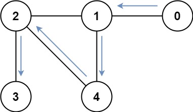

# BFS

常见于求解最短路径问题，图论问题（矩阵、连通图）

## BFS模板

基于层数

```java
//队列
Queue<int[]> que = new ArrayDeque<>();
//起点入队列 如果没指明起点 就将所有结点都入队
que.offer(new int[]{init_x,init_y});
//判断当前结点是否访问过 注意必须是x,y,state
boolean[] visited = new boolean[n];
visited[beginnode_x][beginnode_y] = true;
int step = 0;
while(!que.isEmpty()){
    int size = que.size();
    while(size > 0){
        int[] cur = que.poll();
        
        //找到答案 退出
        if(cur == target){
            return step;
        }
        //矩阵则遍历四个位置
        for(int[] dir : dirs){
            int nx = x + dir[0];
            int ny = y + dir[1];
            //判断是否超出范围
            if(nx < 0 || nx >= m || ny < 0 || ny >= n) continue;
            //判断其他条件
            //判断是否访问过 没有就入队列
            if(!visited[nx][ny]){
                visited[nx][ny] = true;
                que.offer(new int[]{nx,ny,n_state});
            }
        }
        size--;
    }
    step++;
}
```

也可以将步长作为结点信息入队

```java
//队列
Queue<int[]> que = new ArrayDeque<>();
//起点入队列 如果没指明起点 就将所有结点都入队
que.offer(new int[]{begin_node,0});
//判断当前结点是否访问过 注意必须是x,y,state
boolean[] visited = new boolean[n];
visited[beginnode] = true;
while(!que.isEmpty()){
    
    int[] cur = que.poll();

    //找到答案 退出
    if(cur == target){
        return step;
    }
    for(int x : cur.children) {
        if(!vis[x]) {
            q.push({x, step + 1});
            vis[x] = true;
        }
    }
}
```

## 状态压缩

状态压缩也即用一个变量来表示当前状态，比较常用的方式是利用一个 n 位 k 进制数mask 表示当前 n 个节点的所处的 k 个不同状态。


一些状态压缩的基本操作如下：

（1）访问第 i 个点的状态：`state >> i & 1 == 0` true 或者false

（2）更改第 i 个点状态为 1：`mask = mask | (1 << i)`

## 基于状态压缩的BFS

https://leetcode.cn/problems/shortest-path-visiting-all-nodes/solutions/918634/gtalgorithm-tu-jie-fa-ba-hardbian-cheng-v5knb/

### lc 864. 获取所有钥匙的最短路径

给定一个二维网格 `grid` ，其中：

- '.' 代表一个空房间
- '#' 代表一堵
- '@' 是起点
- 小写字母代表钥匙
- 大写字母代表锁

我们从起点开始出发，一次移动是指向四个基本方向之一行走一个单位空间。我们不能在网格外面行走，也无法穿过一堵墙。如果途经一个钥匙，我们就把它捡起来。除非我们手里有对应的钥匙，否则无法通过锁。

假设 k 为 钥匙/锁 的个数，且满足 `1 <= k <= 6`，字母表中的前 `k` 个字母在网格中都有自己对应的一个小写和一个大写字母。换言之，每个锁有唯一对应的钥匙，每个钥匙也有唯一对应的锁。另外，代表钥匙和锁的字母互为大小写并按字母顺序排列。

返回获取所有钥匙所需要的移动的最少次数。如果无法获取所有钥匙，返回 `-1` 。

**示例 1：**


```
输入：grid = ["@.a.#","###.#","b.A.B"]
输出：8
解释：目标是获得所有钥匙，而不是打开所有锁。
```

**示例 2：**


```
输入：grid = ["@..aA","..B#.","....b"]
输出：6
```

**示例 3:**


```
输入: grid = ["@Aa"]
输出: -1
```

 

**提示：**

- `m == grid.length`
- `n == grid[i].length`
- `1 <= m, n <= 30`
- `grid[i][j]` 只含有 `'.'`, `'#'`, `'@'`, `'a'-``'f``'` 以及 `'A'-'F'`
- 钥匙的数目范围是 `[1, 6]` 
- 每个钥匙都对应一个 **不同** 的字母
- 每个钥匙正好打开一个对应的锁

#### 题解

最短路径问题直接套BFS模板求解

关键api:

**Queue队列**

`Queue<int[]> que = new ArrayDeque<>();`

`que.offer(new int[]{init_x,init_y,0});`

`que.poll();`

**四个方向**

`int dirs[][] = {{1,0},{-1,0},{0,1},{0,-1}};`

**状态压缩**

使用位运算表示钥匙状态 需要熟悉左移右移操作

eg.101010：表示bdf钥匙找到

初始化为`1 << k` 当达到`state == 1 << k - 1`时即找到所有钥匙

每次找到字符c：`n_state |= 1 << (c - 'a');`

判断锁是否有对应的钥匙`(Character.isUpperCase(c) && (state >> (c - 'A') & 1) == 0)`

BFS需要一个`visited数组`做记忆化操作，记录以及遍历的结点

```java
class Solution {
     /**
        最短路径：使用BFS查找
        初始化：先遍历统计钥匙数量以及出发点
        状态表示：使用位运算表示钥匙状态
            eg.101010：表示bdf钥匙找到
            初始化为1 << k 当达到state == 1 << k - 1时即找到所有钥匙
            每次找到字符c：state |= 1 << (c - 'a');
     **/
    int dirs[][] = {{1,0},{-1,0},{0,1},{0,-1}};
    int k = 0; //钥匙数量
    int init_x = 0,init_y = 0; //起始位置
    public int shortestPathAllKeys(String[] grid) {
        //遍历grid统计钥匙数量以及出发点
        int m = grid.length;
        int n = grid[0].length();
        for(int i = 0; i < m; i++){
            for(int j = 0; j < n; j++){
                char c = grid[i].charAt(j);
                if(Character.isLowerCase(c)){
                    k++;
                }else if(c == '@'){
                    init_x = i;
                    init_y = j;
                }
            }
        }
        Queue<int[]> que = new ArrayDeque<>();
        que.offer(new int[]{init_x,init_y,0});
        //判断当前结点是否访问过 注意必须是x,y,state
        boolean[][][] visited = new boolean[m][n][1<<k];
        visited[init_x][init_y][0] = true;
        int step = 0;
        while(!que.isEmpty()){
            int size = que.size();
            while(size > 0){
                int[] cur = que.poll();
                int x = cur[0];
                int y = cur[1];
                int state = cur[2];
                //找到了所有的钥匙了
                if(state == (1 << k) - 1){
                    return step;
                }
                //遍历四个位置
                for(int[] dir : dirs){
                    int nx = x + dir[0];
                    int ny = y + dir[1];
                    //判断是否超出范围
                    if(nx < 0 || nx >= m || ny < 0 || ny >= n) continue;
                    //判断是否是墙或者是没找到钥匙的锁
                    char c = grid[nx].charAt(ny);
                    if(c == '#' || (Character.isUpperCase(c) && (state >> (c - 'A') & 1) == 0)) continue;
                    //是钥匙 更新状态
                    //注意这里不能直接修改state 否则污染其他方向
                    int n_state = state;
                    if(Character.isLowerCase(c)){
                        n_state |= 1 << (c - 'a');
                    }
                    //判断是否访问过 没有就入队列
                    if(!visited[nx][ny][n_state]){
                        visited[nx][ny][n_state] = true;
                        que.offer(new int[]{nx,ny,n_state});
                    }
                }
                size--;
            }
            step++;
        }
        return -1;
    }
}
```

### lc 847. 访问所有节点的最短路径

存在一个由 `n` 个节点组成的无向连通图，图中的节点按从 `0` 到 `n - 1` 编号。

给你一个数组 `graph` 表示这个图。其中，`graph[i]` 是一个列表，由所有与节点 `i` 直接相连的节点组成。

返回能够访问所有节点的最短路径的长度。你可以在任一节点开始和停止，也可以多次重访节点，并且可以重用边。

 


**示例 1：**


```
输入：graph = [[1,2,3],[0],[0],[0]]
输出：4
解释：一种可能的路径为 [1,0,2,0,3]
```

**示例 2：**



```
输入：graph = [[1],[0,2,4],[1,3,4],[2],[1,2]]
输出：4
解释：一种可能的路径为 [0,1,4,2,3]
```

 

**提示：**

- `n == graph.length`
- `1 <= n <= 12`
- `0 <= graph[i].length < n`
- `graph[i]` 不包含 `i`
- 如果 `graph[a]` 包含 `b` ，那么 `graph[b]` 也包含 `a`
- 输入的图总是连通图

#### 题解

本题也是状态压缩+BFS

注意由于不是矩阵每一次都遍历四个方向，因此在结点信息中加入当前步长

`(curNode,state,step)`因此遍历时也不需要size()来记录层数

```java
class Solution {
    public int shortestPathLength(int[][] graph) {
        int n = graph.length;
        //[n][1<<n] n表示当前结点 1<<n表示当前状态
        boolean[][] visited = new boolean[n][1 << n];
        Queue<int[]> que = new ArrayDeque<>();//数组记录三个属性(curNode,state,step)
        //把所有结点入栈
        for(int i = 0; i < n; i++){
            que.offer(new int[]{i,1 << i,0});
            visited[i][1 << i] = true;
        }
        while(!que.isEmpty()){
            //不需要size size用于记录层数
            int[] cur = que.poll();
            int index = cur[0];
            int state = cur[1];
            int step = cur[2];
            //已经找到所有结点了
            if(state == (1 << n) - 1) return step;
            for(int i : graph[index]){
                //更新状态
                int n_state = state;
                n_state |= 1 << i;
                if(!visited[i][n_state]){
                    visited[i][n_state] = true;
                    que.offer(new int[]{i,n_state,step+1});
                }
            }
                
        }
        return 0;
    }
}
```


