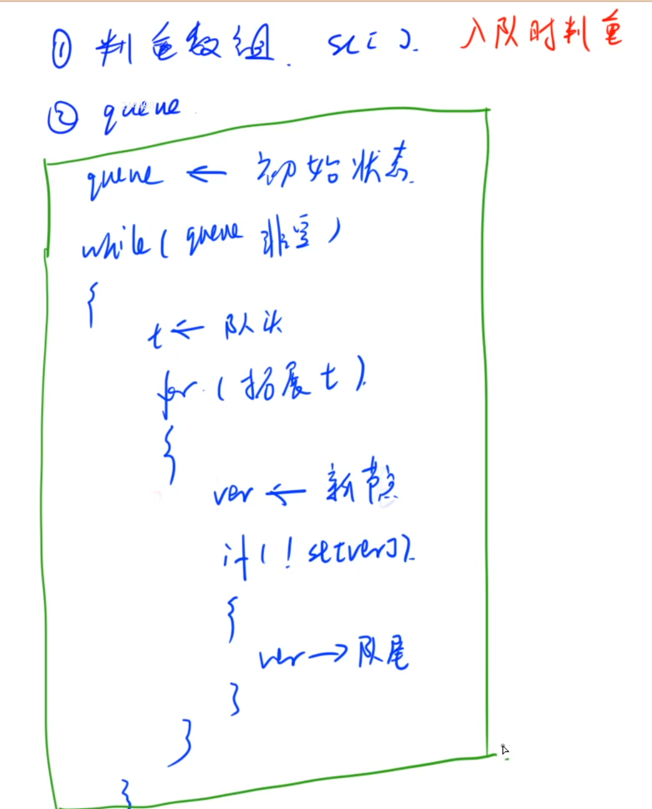

# BFS

常见于求解最短路径问题，图论问题（矩阵、连通图）



关键要素在于队列queue+判重（记忆化）

- queue里可以放Integer、Strting、int[]等
- 判重可以用数组、矩阵、或者状态压缩（String、Map）

## BFS模板

基于层数

```java
import java.util.*;
public class Main{
    static Scanner sc = new Scanner(System.in);
    static int N = 110, M = 110;
    static int[][] dirs = {{1,0},{0,-1},{-1,0},{0,1}};
    static int[][] mat = new int[N][M];
    static boolean[][] st = new boolean[N][M];
    public static void main(String[] args){
        int n = sc.nextInt(), m = sc.nextInt();
        for(int i = 0; i < n; i++){
            for(int j = 0; j < m; j++){
                mat[i][j] = sc.nextInt();
            }
        }
        Queue<int[]> que = new LinkedList<>();
        int step = 0;
        que.offer(new int[]{0,0});
        st[0][0] = true;
        while(!que.isEmpty()){
            int sz = que.size();
            while(sz-- > 0){
                int[] cur = que.poll();
                if(cur[0] == n - 1 && cur[1] == m - 1){
                    System.out.print(step);
                    return;
                }
                //遍历四个方向
                for(int i = 0; i < 4; i++){
                    int x = cur[0] + dirs[i][0];
                    int y = cur[1] + dirs[i][1];
                    // 越界了或者遍历过或者是墙壁
                    if(x < 0 || x >= n || y < 0 || y >= m || st[x][y] || mat[x][y] == 1) continue;
                    st[x][y] = true;
                    que.offer(new int[]{x,y});
                }
            }
            step++;
        }
    }
}
```

也可以将步长作为结点信息入队

```java
import java.util.*;
public class Main{
    static Scanner sc = new Scanner(System.in);
    static int N = 110, M = 110;
    static int[][] dirs = {{1,0},{0,-1},{-1,0},{0,1}};
    static int[][] g = new int[N][M];
    static boolean[][] st = new boolean[N][M];
    public static void main(String[] args){
        int n = sc.nextInt(), m = sc.nextInt();
        for(int i = 1; i <= n; i++){
            for(int j = 1; j <= m; j++){
                g[i][j] = sc.nextInt();
            }
        }
        Queue<int[]> que = new LinkedList<>(); // x,y,step
        que.offer(new int[]{1,1,0});
        st[1][1] = true;
        while(!que.isEmpty()){
            int[] cur = que.poll();
            int x = cur[0];
            int y = cur[1];
            int step = cur[2];
            if(x == n && y == m){
                System.out.print(step);
                return;
            }
            //遍历四个方向
            for(int i = 0; i < 4; i++){
                int nx = x + dirs[i][0];
                int ny = y + dirs[i][1];
                // 越界了或者遍历过或者是墙壁
                if(nx <= 0 || nx > n || ny <= 0 || ny > m || st[nx][ny] || g[nx][ny] == 1) continue;
                st[nx][ny] = true;
                que.offer(new int[]{nx,ny,step+1});
            }
        }
    }
}
```

## 迷宫问题【矩阵】

link:https://www.acwing.com/problem/content/846/

给定一个 n×m× 的二维整数数组，用来表示一个迷宫，数组中只包含 00 或 11，其中 00 表示可以走的路，11 表示不可通过的墙壁。

最初，有一个人位于左上角 (1,1)(1,1) 处，已知该人每次可以向上、下、左、右任意一个方向移动一个位置。

请问，该人从左上角移动至右下角 (n,m)(,) 处，至少需要移动多少次。

数据保证 (1,1)(1,1) 处和 (n,m)(,) 处的数字为 00，且一定至少存在一条通路。

#### 输入格式

第一行包含两个整数 n 和 m。

接下来 n 行，每行包含 m 个整数（00 或 11），表示完整的二维数组迷宫。

#### 输出格式

输出一个整数，表示从左上角移动至右下角的最少移动次数。

#### 数据范围

1≤n,m≤1001≤,≤100

#### 输入样例：

```
5 5
0 1 0 0 0
0 1 0 1 0
0 0 0 0 0
0 1 1 1 0
0 0 0 1 0
```

#### 输出样例：

```
8
```

#### code

```java
import java.util.*;
public class Main{
    static Scanner sc = new Scanner(System.in);
    static int N = 110, M = 110;
    static int[][] dirs = {{1,0},{0,-1},{-1,0},{0,1}};
    static int[][] mat = new int[N][M];
    static boolean[][] st = new boolean[N][M];
    public static void main(String[] args){
        int n = sc.nextInt(), m = sc.nextInt();
        for(int i = 0; i < n; i++){
            for(int j = 0; j < m; j++){
                mat[i][j] = sc.nextInt();
            }
        }
        Queue<int[]> que = new LinkedList<>();
        int step = 0;
        que.offer(new int[]{0,0});
        st[0][0] = true;
        while(!que.isEmpty()){
            int sz = que.size();
            while(sz-- > 0){
                int[] cur = que.poll();
                if(cur[0] == n - 1 && cur[1] == m - 1){
                    System.out.print(step);
                    return;
                }
                //遍历四个方向
                for(int i = 0; i < 4; i++){
                    int x = cur[0] + dirs[i][0];
                    int y = cur[1] + dirs[i][1];
                    // 越界了或者遍历过或者是墙壁
                    if(x < 0 || x >= n || y < 0 || y >= m || st[x][y] || mat[x][y] == 1) continue;
                    st[x][y] = true;
                    que.offer(new int[]{x,y});
                }
            }
            step++;
        }
    }
}
```


## 八数码问题【map判重】

link: https://www.acwing.com/problem/content/847/

在一个 3×33×3 的网格中，1∼81∼8 这 88 个数字和一个 `x` 恰好不重不漏地分布在这 3×33×3 的网格中。

例如：

```
1 2 3
x 4 6
7 5 8
```

在游戏过程中，可以把 `x` 与其上、下、左、右四个方向之一的数字交换（如果存在）。

我们的目的是通过交换，使得网格变为如下排列（称为正确排列）：

```
1 2 3
4 5 6
7 8 x
```

例如，示例中图形就可以通过让 `x` 先后与右、下、右三个方向的数字交换成功得到正确排列。

交换过程如下：

```
1 2 3   1 2 3   1 2 3   1 2 3
x 4 6   4 x 6   4 5 6   4 5 6
7 5 8   7 5 8   7 x 8   7 8 x
```

现在，给你一个初始网格，请你求出得到正确排列至少需要进行多少次交换。

#### 输入格式

输入占一行，将 3×33×3 的初始网格描绘出来。

例如，如果初始网格如下所示：

```
1 2 3 
x 4 6 
7 5 8 
```

则输入为：`1 2 3 x 4 6 7 5 8`

#### 输出格式

输出占一行，包含一个整数，表示最少交换次数。

如果不存在解决方案，则输出 −1−1。

#### 输入样例：

```
2 3 4 1 5 x 7 6 8
```

#### 输出样例

```
19
```

#### code

```java
import java.util.*;
public class Main{
    static Scanner sc = new Scanner(System.in);
    // BFS，使用字符串表示状态
    // 使用Map来存储<String,int> 状态，步长
    static Map<String,Integer> map = new HashMap<>();
    static String end = "12345678x";
    static int[] dx = {1,0,-1,0}, dy = {0,-1,0,1};
    // 交换
    public static String swap(String s, int a, int b){
        char[] chs = s.toCharArray();
        char c = chs[a];
        chs[a] = chs[b];
        chs[b] = c;
        return new String(chs);
    }
    // 深搜
    public static int bfs(String start){
        map.put(start,0);
        Queue<String> que = new LinkedList<>();
        que.offer(start);
        while(!que.isEmpty()){
            String cur = que.poll();
            int step = map.get(cur);
            if(cur.equals(end)) return step;
            int index = cur.indexOf('x');
            int x = index / 3, y = index % 3;
            for(int i = 0; i < 4; i++){
                int nx = x + dx[i];
                int ny = y + dy[i];
                if(nx < 0 || nx >= 3 || ny < 0 | ny >= 3) continue;
                String ns = swap(cur,index,nx * 3 + ny);
                if(map.containsKey(ns)) continue;
                else{
                    map.put(ns,step + 1);
                    que.offer(ns);
                }
            }
        }
        return -1;
    }
    public static void main(String[] args){
        String[] s1 = sc.nextLine().split(" ");
        StringBuilder sb = new StringBuilder();
        for(String s : s1) sb.append(s);
        String start = sb.toString();
        System.out.print(bfs(start));
    }
}
```

## 岛屿问题

link:https://www.acwing.com/problem/content/1235/

你有一张某海域 N×N× 像素的照片，”.”表示海洋、”#”表示陆地，如下所示：

```
.......
.##....
.##....
....##.
..####.
...###.
.......
```

其中”上下左右”四个方向上连在一起的一片陆地组成一座岛屿，例如上图就有 22 座岛屿。

由于全球变暖导致了海面上升，科学家预测未来几十年，岛屿边缘一个像素的范围会被海水淹没。

具体来说如果一块陆地像素与海洋相邻(上下左右四个相邻像素中有海洋)，它就会被淹没。

例如上图中的海域未来会变成如下样子：

```
.......
.......
.......
.......
....#..
.......
.......
```

请你计算：依照科学家的预测，照片中有多少岛屿会被完全淹没。

#### 输入格式

第一行包含一个整数N。

以下 N 行 N 列，包含一个由字符”#”和”.”构成的 N×N× 字符矩阵，代表一张海域照片，”#”表示陆地，”.”表示海洋。

照片保证第 11 行、第 11 列、第 N 行、第 N 列的像素都是海洋。

#### 输出格式

一个整数表示答案。

#### 数据范围

1≤N≤10001≤≤1000

#### 输入样例1：

```
7
.......
.##....
.##....
....##.
..####.
...###.
.......
```

#### 输出样例1：

```
1
```

#### 输入样例2：

```
9
.........
.##.##...
.#####...
.##.##...
.........
.##.#....
.#.###...
.#..#....
.........
```

#### 输出样例2：

```
1
```

#### code

- 关键在于利用bfs找到岛屿（找岛屿过程中同时计数total与bound）

```java
import java.util.*;
import java.io.*;
public class Main{
    static BufferedReader br = new BufferedReader(new InputStreamReader(System.in));
    static Scanner sc = new Scanner(System.in);
    static int N = 1010;
    static char[][] g = new char[N][N];
    static boolean[][] st = new boolean[N][N];
    static int[] dx = {1,0,-1,0}, dy = {0,-1,0,1};
    static int n;
    public static int bfs(int i, int j){
        int total = 0, bound = 0;
        Queue<int[]> que = new LinkedList<>();
        que.offer(new int[]{i,j});
        st[i][j] = true;
        while(!que.isEmpty()){
            int[] cur = que.poll();
            int x = cur[0], y = cur[1];
            total++;
            boolean is_bound = false;
            for(i = 0; i < 4; i++){
                int nx = x + dx[i], ny = y + dy[i];
                if(nx < 0 || nx >= n || ny < 0 || ny >= n) continue;
                if(st[nx][ny]) continue;
                if(g[nx][ny] == '.') is_bound = true;
                else{
                    st[nx][ny] = true;
                    que.offer(new int[]{nx,ny});
                }
            }
            if(is_bound) bound++;
        }
        return total == bound ? 1 : 0;
    }
    public static void main(String[] args) throws IOException{
        n = Integer.parseInt(br.readLine());
        for(int i = 0; i < n; i++){
            g[i] = br.readLine().toCharArray();
        }
        int cnt = 0;
        for(int i = 0; i < n; i++){
            for(int j = 0; j < n; j++){
                if(!st[i][j] && g[i][j] == '#'){
                    cnt += bfs(i,j);
                }
            }
        }
        System.out.print(cnt);
    }
}
```


## 基于状态压缩的BFS

### 状态压缩

状态压缩也即用一个变量来表示当前状态，比较常用的方式是利用一个 n 位 k 进制数mask 表示当前 n 个节点的所处的 k 个不同状态。


一些状态压缩的基本操作如下：

（1）访问第 i 个点的状态：`(state >> i & 1) == 0` true 或者false

注意前面部分要加括号，因为==运算优先级大于&

（2）更改第 i 个点状态为 1：`mask = mask | (1 << i)`

https://leetcode.cn/problems/shortest-path-visiting-all-nodes/solutions/918634/gtalgorithm-tu-jie-fa-ba-hardbian-cheng-v5knb/

### lc 864. 获取所有钥匙的最短路径

link:https://leetcode.cn/problems/shortest-path-to-get-all-keys/description/

给定一个二维网格 `grid` ，其中：

- '.' 代表一个空房间
- '#' 代表一堵
- '@' 是起点
- 小写字母代表钥匙
- 大写字母代表锁

我们从起点开始出发，一次移动是指向四个基本方向之一行走一个单位空间。我们不能在网格外面行走，也无法穿过一堵墙。如果途经一个钥匙，我们就把它捡起来。除非我们手里有对应的钥匙，否则无法通过锁。

假设 k 为 钥匙/锁 的个数，且满足 `1 <= k <= 6`，字母表中的前 `k` 个字母在网格中都有自己对应的一个小写和一个大写字母。换言之，每个锁有唯一对应的钥匙，每个钥匙也有唯一对应的锁。另外，代表钥匙和锁的字母互为大小写并按字母顺序排列。

返回获取所有钥匙所需要的移动的最少次数。如果无法获取所有钥匙，返回 `-1` 。

**示例 1：**


```
输入：grid = ["@.a.#","###.#","b.A.B"]
输出：8
解释：目标是获得所有钥匙，而不是打开所有锁。
```

**示例 2：**


```
输入：grid = ["@..aA","..B#.","....b"]
输出：6
```

**示例 3:**


```
输入: grid = ["@Aa"]
输出: -1
```

 

**提示：**

- `m == grid.length`
- `n == grid[i].length`
- `1 <= m, n <= 30`
- `grid[i][j]` 只含有 `'.'`, `'#'`, `'@'`, `'a'-``'f``'` 以及 `'A'-'F'`
- 钥匙的数目范围是 `[1, 6]` 
- 每个钥匙都对应一个 **不同** 的字母
- 每个钥匙正好打开一个对应的锁

#### 题解

最短路径问题直接套BFS模板求解

关键api:

**Queue队列**

`Queue<int[]> que = new ArrayDeque<>();`

`que.offer(new int[]{init_x,init_y,0});`

`que.poll();`

**四个方向**

`int dirs[][] = {{1,0},{-1,0},{0,1},{0,-1}};`

**状态压缩**

使用位运算表示钥匙状态 需要熟悉左移右移操作

eg.101010：表示bdf钥匙找到

初始化为`1 << k` 当达到`state == 1 << k - 1`时即找到所有钥匙

每次找到字符c：`n_state |= 1 << (c - 'a');`

判断锁是否有对应的钥匙`(Character.isUpperCase(c) && (state >> (c - 'A') & 1) == 0)`

BFS需要一个`visited数组`做记忆化操作，记录以及遍历的结点

```java
class Solution {
     /**
        最短路径：使用BFS查找
        初始化：先遍历统计钥匙数量以及出发点
        状态表示：使用位运算表示钥匙状态
            eg.101010：表示bdf钥匙找到
            初始化为1 << k 当达到state == 1 << k - 1时即找到所有钥匙
            每次找到字符c：state |= 1 << (c - 'a');
     **/
    int dirs[][] = {{1,0},{-1,0},{0,1},{0,-1}};
    int k = 0; //钥匙数量
    int init_x = 0,init_y = 0; //起始位置
    public int shortestPathAllKeys(String[] grid) {
        //遍历grid统计钥匙数量以及出发点
        int m = grid.length;
        int n = grid[0].length();
        for(int i = 0; i < m; i++){
            for(int j = 0; j < n; j++){
                char c = grid[i].charAt(j);
                if(Character.isLowerCase(c)){
                    k++;
                }else if(c == '@'){
                    init_x = i;
                    init_y = j;
                }
            }
        }
        Queue<int[]> que = new ArrayDeque<>();
        que.offer(new int[]{init_x,init_y,0});
        //判断当前结点是否访问过 注意必须是x,y,state
        boolean[][][] visited = new boolean[m][n][1<<k];
        visited[init_x][init_y][0] = true;
        int step = 0;
        while(!que.isEmpty()){
            int size = que.size();
            while(size > 0){
                int[] cur = que.poll();
                int x = cur[0];
                int y = cur[1];
                int state = cur[2];
                //找到了所有的钥匙了
                if(state == (1 << k) - 1){
                    return step;
                }
                //遍历四个位置
                for(int[] dir : dirs){
                    int nx = x + dir[0];
                    int ny = y + dir[1];
                    //判断是否超出范围
                    if(nx < 0 || nx >= m || ny < 0 || ny >= n) continue;
                    //判断是否是墙或者是没找到钥匙的锁
                    char c = grid[nx].charAt(ny);
                    if(c == '#' || (Character.isUpperCase(c) && (state >> (c - 'A') & 1) == 0)) continue;
                    //是钥匙 更新状态
                    //注意这里不能直接修改state 否则污染其他方向
                    int n_state = state;
                    if(Character.isLowerCase(c)){
                        n_state |= 1 << (c - 'a');
                    }
                    //判断是否访问过 没有就入队列
                    if(!visited[nx][ny][n_state]){
                        visited[nx][ny][n_state] = true;
                        que.offer(new int[]{nx,ny,n_state});
                    }
                }
                size--;
            }
            step++;
        }
        return -1;
    }
}
```

### lc 847. 访问所有节点的最短路径

存在一个由 `n` 个节点组成的无向连通图，图中的节点按从 `0` 到 `n - 1` 编号。

给你一个数组 `graph` 表示这个图。其中，`graph[i]` 是一个列表，由所有与节点 `i` 直接相连的节点组成。

返回能够访问所有节点的最短路径的长度。你可以在任一节点开始和停止，也可以多次重访节点，并且可以重用边。

 


**示例 1：**


```
输入：graph = [[1,2,3],[0],[0],[0]]
输出：4
解释：一种可能的路径为 [1,0,2,0,3]
```

**示例 2：**


```
输入：graph = [[1],[0,2,4],[1,3,4],[2],[1,2]]
输出：4
解释：一种可能的路径为 [0,1,4,2,3]
```

 

**提示：**

- `n == graph.length`
- `1 <= n <= 12`
- `0 <= graph[i].length < n`
- `graph[i]` 不包含 `i`
- 如果 `graph[a]` 包含 `b` ，那么 `graph[b]` 也包含 `a`
- 输入的图总是连通图

#### 题解

本题也是状态压缩+BFS

注意由于不是矩阵每一次都遍历四个方向，因此在结点信息中加入当前步长

`(curNode,state,step)`因此遍历时也不需要size()来记录层数

```java
class Solution {
    public int shortestPathLength(int[][] graph) {
        int n = graph.length;
        //[n][1<<n] n表示当前结点 1<<n表示当前状态
        boolean[][] visited = new boolean[n][1 << n];
        Queue<int[]> que = new ArrayDeque<>();//数组记录三个属性(curNode,state,step)
        //把所有结点入栈
        for(int i = 0; i < n; i++){
            que.offer(new int[]{i,1 << i,0});
            visited[i][1 << i] = true;
        }
        while(!que.isEmpty()){
            //不需要size size用于记录层数
            int[] cur = que.poll();
            int index = cur[0];
            int state = cur[1];
            int step = cur[2];
            //已经找到所有结点了
            if(state == (1 << n) - 1) return step;
            for(int i : graph[index]){
                //更新状态
                int n_state = state;
                n_state |= 1 << i;
                if(!visited[i][n_state]){
                    visited[i][n_state] = true;
                    que.offer(new int[]{i,n_state,step+1});
                }
            }
                
        }
        return 0;
    }
}
```


## 二叉树

最小深度、最大深度

以下以LeetCode111.二叉树的最小深度https://leetcode.cn/problems/minimum-depth-of-binary-tree/description/为例引出bfs的经典模板

最小深度就是当存在结点没有孩子结点就返回

```java
 //最小深度bfs经典模板
class Solution {
    public int minDepth(TreeNode root) {
        Queue<TreeNode> que = new LinkedList<>();
        if(root == null) return 0;
        que.offer(root);
        int depth = 0;
        while(!que.isEmpty()){
            depth++;
            int size = que.size();
            while(size > 0){
                size--;
                TreeNode cur = que.poll();
                if(cur.left != null) que.offer(cur.left);
                if(cur.right != null) que.offer(cur.right);
                if(cur.left == null && cur.right == null) return depth;
            }
        }
        return depth;
    }
}
```

对比：LeetCode 104. 二叉树的最大深度

https://leetcode.cn/problems/maximum-depth-of-binary-tree/description/

与最小深度唯一的不同就是去掉了

`if(cur.left == null && cur.right == null) return depth;`这一行，因为最大深度就是要遍历每一层 直接套用层次遍历模板遍历完即可

```java
//使用bfs模板解
    public int maxDepth(TreeNode root) {
        Queue<TreeNode> que = new LinkedList<>();
        if(root == null) return 0;
        que.offer(root);
        int depth = 0;
        while(!que.isEmpty()){
            depth++;
            int size = que.size();
            while(size > 0){
                size--;
                TreeNode cur = que.poll();
                if(cur.left != null) que.offer(cur.left);
                if(cur.right != null) que.offer(cur.right);
                // if(cur.left == null && cur.right == null) return depth;
            }
        }
        return depth;
    }
```

