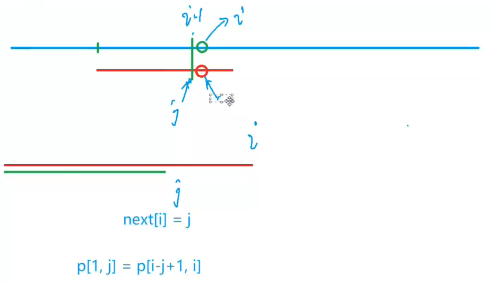

# KMP

注意点：字符串下标从1开始

- next[i]：前i个字母构成的字符串中最长的与前缀相等的后缀的长度（非平凡）平凡就是整个串，next数组要对短串求
- p短串
- s长串（被查找串）

```
abaabc
next[5] = 2
```

如何利用next加速查找

```
长串：abaababaabcabaa
短串：abaabc
abaababaabcabaa
abaabc
   abaabc
当匹配到s[i] != p[j+1] j = ne[j];
```


- 求next数组时 i从2开始
  - 因为ne[1]：是非平凡
- 求匹配下标：`i-n` 



```java
import java.util.*;
import java.io.*;

class Main{
    static BufferedReader br = new BufferedReader(new InputStreamReader(System.in));
    static BufferedWriter bw = new BufferedWriter(new OutputStreamWriter(System.out));
    public static void main(String[] args) throws IOException{
        int n = Integer.parseInt(br.readLine());
        String pp = " " + br.readLine();
        int m = Integer.parseInt(br.readLine());
        String ss = " " + br.readLine();
        char[] p = pp.toCharArray();
        char[] s = ss.toCharArray();
        int[] ne = new int[n + 1];
        //求next数组
        for(int i = 2, j = 0; i <= n; i++){
            
            while(j > 0 && p[i] != p[j+1]) j = ne[j];
            if(p[i] == p[j+1]) j++;
            //记录
            ne[i] = j;
        }
        //匹配
        for(int i = 1, j = 0; i <= m; i++){
            // j没有退回起点
            while(j > 0 && s[i] != p[j+1]) j = ne[j];
            if(s[i] == p[j+1]) j++;
            if(j == n){
                // 匹配成功
                bw.write(i-n+" ");
                //继续匹配剩余的串
                j = ne[j];   
            }
        }
        bw.flush();
    }
}
```

## 字符串匹配问题

- [28.找出字符串中第一个匹配项的下标](https://leetcode.cn/problems/find-the-index-of-the-first-occurrence-in-a-string/)
- [AcWing 831. KMP字符串](https://www.acwing.com/activity/content/problem/content/8072/)

## 重复字符串问题

```
s = "abab"
由ab组成
s = "abcabcabcabc"
由"abc"或者"abcabc"组成
```

以[AcWing 141. 周期](https://www.acwing.com/activity/content/problem/content/8071/)来讲

一个字符串的前缀是从第一个字符开始的连续若干个字符，例如 `abaab` 共有 55 个前缀，分别是 `a`，`ab`，`aba`，`abaa`，`abaab`。

我们希望知道一个 N 位字符串 S 的前缀是否具有循环节。

换言之，对于每一个从头开始的长度为 i（i>1>1）的前缀，是否由重复出现的子串 A 组成，即 AAA…A… （A 重复出现 K 次,K>1>1）。

如果存在，请找出最短的循环节对应的 K 值（也就是这个前缀串的所有可能重复节中，最大的 K 值）。

#### 输入格式

输入包括多组测试数据，每组测试数据包括两行。

第一行输入字符串 S 的长度 N。

第二行输入字符串 S。

输入数据以只包括一个 00 的行作为结尾。

#### 输出格式

对于每组测试数据，第一行输出 `Test case #` 和测试数据的编号。

接下来的每一行，输出具有循环节的前缀的长度 i 和其对应 K，中间用一个空格隔开。

前缀长度需要升序排列。

在每组测试数据的最后输出一个空行。

#### 数据范围

2≤N≤10000002≤≤1000000

#### 输入样例：

```
3
aaa
4
abcd
12
aabaabaabaab
0
```

#### 输出样例：

```
Test case #1
2 2
3 3

Test case #2

Test case #3
2 2
6 2
9 3
12 4
```

#### 思路

先用KMP算法求出每个字符串的next数组，然后遍历字符串[1,n]

如果`ne[i] > 0 && i % (i - ne[i]) == 0`那么当前字符串[1,i]就是一个重复字符串

`i - ne[i]` 是最小重复单元的长度

`int k = i / (i - ne[i]);` 重复个数

- [459. 重复的子字符串](https://leetcode.cn/problems/repeated-substring-pattern/)
- [AcWing 141. 周期](https://www.acwing.com/activity/content/problem/content/8071/)

