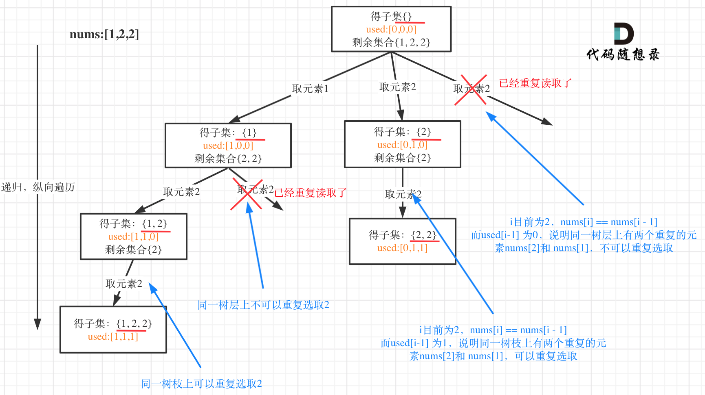
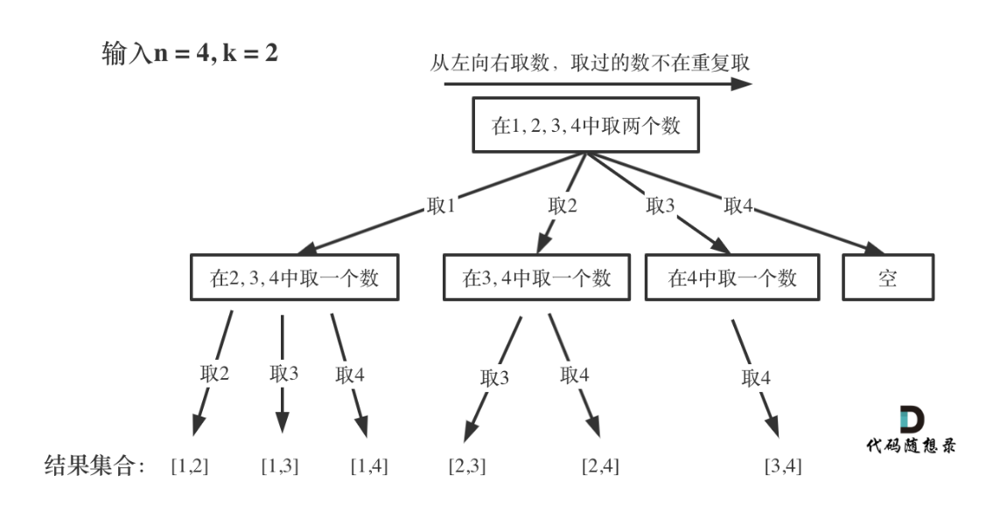

总结

- 指数型：state[]
- 排列型：state[] used[]
- 组合型：state[] startIndex（startIndex标记从输入数组的哪一个位置开始遍历）

## **指数型枚举**

### 方法1：数组

dfs思考递归搜索树，用state[]数组记录状态

```java
import java.util.*;
public class Main{
    static boolean[] state; //记录选择状态 为true表示选择
    static int n;
    public static void main(String[] args){
        Scanner sc = new Scanner(System.in);
        n = sc.nextInt();
        state = new boolean[n + 1];
        dfs(1);
    }
    public static void dfs(int index){
        if(index > n){
            //输出
            for(int i = 1; i <= n; i++){
                if(state[i]) System.out.print(i + " ");
            }
            System.out.println();
            return;
        }
        state[index] = true;
        dfs(index + 1);
        state[index] = false;
        dfs(index + 1);
    }
}
```

### 方法2：List

```java
import java.util.*;
public class Main{
    static LinkedList<Integer> path;
    static List<List<Integer>> res;
    static int n;
    public static void main(String[] args){
        Scanner sc = new Scanner(System.in);
        n = sc.nextInt();
        path = new LinkedList<>();
        res = new ArrayList<>();
        dfs(1);
        for(List<Integer> path : res){
            for(int i : path) System.out.print(i + " ");
            System.out.println();
        }
    }
    public static void dfs(int index){
        if(index > n){
            //输出
            res.add(new ArrayList<>(path));
            return;
        }
        path.add(index);
        dfs(index + 1);
        path.removeLast();
        dfs(index + 1);
    }
}
```

## **排列型枚举**

### 方法1：数组

两个数组记录状态

state[]数组记录每个位置的状态

used[]数组记录数值是否用过

```java
import java.util.*;

public class Main{
    static int n;
    static int[] state; //记录路径
    static boolean[] used; //记录当前数字是否用过
    public static void main(String[] args){
        Scanner sc = new Scanner(System.in);
        n = sc.nextInt();
        used = new boolean[n + 1];
        state = new int[n + 1];
        dfs(1);//因为答案要求从1开始
    }
    public static void dfs(int index){
        if(index > n){
            for(int i = 1; i <= n; i++){
                System.out.print(state[i] + " ");
            }
            System.out.println();
            return;
        }
        for(int i = 1; i <= n; i++){
            if(used[i]) continue;
            used[i] = true; //记录已经使用过
            state[index] = i; //记录路径
            dfs(index + 1);
            used[i] = false;
        }
    }
}
```

### 方法2：List

```java
import java.util.*;

public class Main{
    static int n;
    static LinkedList<Integer> path;
    static List<List<Integer>> res;
    static boolean[] used; //记录当前数字是否用过
    public static void main(String[] args){
        Scanner sc = new Scanner(System.in);
        n = sc.nextInt();
        used = new boolean[n + 1];
        path = new LinkedList<>();
        res = new ArrayList<>();
        // state = new int[n + 1];
        dfs(1);//因为答案要求从1开始
        for(List<Integer> path : res){
            for(int i : path) System.out.print(i + " ");
            System.out.println();
        }
    }
    public static void dfs(int index){
        if(index > n){
            res.add(new ArrayList<>(path));
            return;
        }
        for(int i = 1; i <= n; i++){
            if(used[i]) continue;
            used[i] = true; //记录已经使用过
            path.add(i);
            dfs(index + 1);
            used[i] = false;
            path.removeLast();
        }
    }
}
```

### 变形：数组中有重复元素 需要返回结果不能重复

剑指Offer 38. 字符串的排列

https://leetcode.cn/problems/zi-fu-chuan-de-pai-lie-lcof/description/

注意点：排序以及加入树层去重



`Arrays.sort(arr);`

`if(i - 1 >= 0 && arr[i - 1] == arr[i] && used[i-1] == false) continue;`

```java
class Solution {
    //全排列问题
    char[] arr;
    StringBuilder path = new StringBuilder();
    List<String> res = new ArrayList<>();
    boolean[] used;
    public String[] permutation(String s) {
        arr = s.toCharArray();
        Arrays.sort(arr);
        used = new boolean[arr.length];
        dfs(0);
        String[] ans = new String[res.size()];
        for(int i = 0; i < res.size(); i++){
            ans[i] = res.get(i);
        }
        return ans;
    }
    public void dfs(int index){
        if(index == arr.length){
            res.add(path.toString());
            return;
        }
        for(int i = 0; i < arr.length; i++){
            //加入同一层去重 如果前面已经用过则不再使用防止重复
            if(i - 1 >= 0 && arr[i - 1] == arr[i] && used[i-1] == false) continue;
            if(!used[i]){
                used[i] = true;
                path.append(arr[i]);
                dfs(index + 1);
                path.deleteCharAt(path.length() - 1);
                used[i] = false;
            }
        }
    }
}
```


## **组合型枚举**

### 方法1：数组

state[]数组记录每个位置的状态，即路径

startIndex记录遍历位置

**n相当于树的宽度，m相当于树的深度**



```java
import java.util.*;
public class Main{
    static int[] state; //记录路径，m个位置都放的是什么数
    static int n;
    static int m;
    public static void main(String[] args){
        Scanner sc = new Scanner(System.in);
        n = sc.nextInt();
        m = sc.nextInt();
        state = new int[m]; 
        dfs(0,1);
    }
    public static void dfs(int index,int startIndex){
        // 剪枝
        //已经不足m个
        if(index + n - startIndex  + 1 < m) return;
        if(index == m){
            //叶子结点
            for(int i = 0; i < m; i++) System.out.print(state[i] + " ");
            System.out.println();
            return;
        }
        for(int i = startIndex; i <= n; i++){
            state[index] = i;
            dfs(index + 1, i + 1);
            state[index] = 0;
        }
    }
}
```

### 方法2：List

```java
import java.util.*;
public class Main{
    // static int[] state; //记录路径，m个位置都放的是什么数
    static int n;
    static int m;
    static LinkedList<Integer> path;
    static List<List<Integer>> res;
    public static void main(String[] args){
        Scanner sc = new Scanner(System.in);
        n = sc.nextInt();
        m = sc.nextInt();
        path = new LinkedList<>();
        res = new ArrayList<>();
        dfs(0,1);
        for(List<Integer> path : res){
            for(int i : path) System.out.print(i + " ");
            System.out.println();
        }
    }
    public static void dfs(int index,int startIndex){
        // 剪枝
        if(index + n - startIndex  + 1 < m) return;
        if(index == m){
            //叶子结点
            res.add(new ArrayList<>(path));
            return;
        }
        for(int i = startIndex; i <= n; i++){
            path.add(i);   
            dfs(index + 1, i + 1);
            path.removeLast();
        }
    }
}
```

## 带分数

### 方法1:

暴力全排列+枚举

```java
import java.util.*;
public class Main{
    static int target; //目标等式的左边
    static int[] nums;  //目标等式的右边
    static boolean[] used; //记录用过的数字
    static int cnt; //记录结果数
    static int N = 10;
    public static void main(String[] args){
        Scanner sc = new Scanner(System.in);
        target = sc.nextInt();
        nums = new int[N];
        used = new boolean[N];
        dfs(0);
        System.out.println(cnt);
    }
    //根据数组左右返回数值
    public static int cal(int l, int r){
        int res = 0;
        for(int i = l; i <= r; i++){
            res = res * 10 + nums[i];
        }
        return res;
    }
    public static void dfs(int index){
        if(index == 9){
            //新的全排列
            //开始枚举a b c
            for(int i = 0; i < 7; i++){
                for(int j = i + 1; j < 8; j++){
                    int a = cal(0,i);
                    int b = cal(i + 1, j);
                    int c = cal(j + 1, 8);
                    //去掉0
                    if(a == 0 || b ==0 || c == 0) continue;
                    //判断是符合
                    if(c * target == c * a + b) cnt++;
                }
            }
            return;
        }
        //继续搜索
        for(int i = 1; i <= 9; i++){
            if(!used[i]){
                used[i] = true;
                nums[index] = i;
                dfs(index + 1);
                used[i] = false;
            }
        }
    }
}
```

### 方法2：

剪枝优化，暴力枚举a ,c b自动得出，判断是否满足

```java
import java.util.*;
public class Main{
    static int target;
    static boolean[] used;
    static int N = 10;
    static int cnt;
    public static void main(String[] args){
        Scanner sc = new Scanner(System.in);
        target = sc.nextInt();
        used = new boolean[N];
        dfs_a(0,0);
        System.out.println(cnt);
    }
    //index表示当前遍历到第几位
    //a表示当前a的值
    public static void dfs_a(int index, int a){
        if(index == 8 || a >= target) return;
        if(a > 0) dfs_c(index, a , 0);
        for(int i = 1; i <= 9; i++){
            if(!used[i]){
                used[i] = true;
                dfs_a(index + 1, a * 10 + i);
                used[i] = false;
            }
        }
    }
    
    public static void dfs_c(int index, int a, int c){
        if(index == 9) return;
        if(c > 0 && check(a,c)) cnt++;
        for(int i = 1; i <= 9; i++){
            if(!used[i]){
                used[i] = true;
                dfs_c(index + 1, a, c * 10 + i);
                used[i] = false;
            }
        }
    }
    //判断当前的a c是否符合条件
    public static boolean check(int a, int c){
        int b = (target - a) * c;
        if(a == 0 || b == 0 || c == 0) return false;
        boolean[] backup = used.clone();
        //先判断b中的数字是否有了，没有就标记为true
        while(b > 0){
            int x = b % 10;
            b /= 10;
            if(x == 0 | backup[x]) return false;
            backup[x] = true;
        }
        //判断used是否全部都用过了
        for(int i = 1; i <= 9; i++){
            if(!backup[i]) return false;
        }
        return true;
    }
}
```

`array.clone()`可以用于复制数组

- array：要复制的数组
- 方法返回一个copy数组
