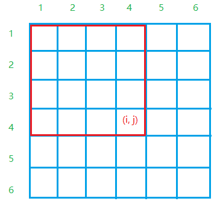
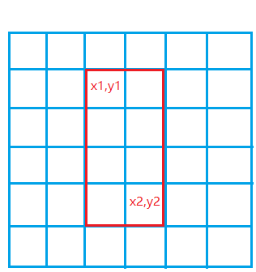
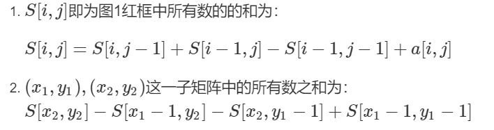

# 前缀和

- 一维
- 二维

## ac795. 前缀和【一维】

输入一个长度为 nn 的整数序列。

接下来再输入 mm 个询问，每个询问输入一对 l,rl,r。

对于每个询问，输出原序列中从第 ll 个数到第 rr 个数的和。

#### 输入格式

第一行包含两个整数 nn 和 mm。

第二行包含 nn 个整数，表示整数数列。

接下来 mm 行，每行包含两个整数 ll 和 rr，表示一个询问的区间范围。

#### 输出格式

共 mm 行，每行输出一个询问的结果。

#### 数据范围

1≤l≤r≤n1≤l≤r≤n,
1≤n,m≤1000001≤n,m≤100000,
−1000≤数列中元素的值≤1000−1000≤数列中元素的值≤1000

#### 输入样例：

```
5 3
2 1 3 6 4
1 2
1 3
2 4
```

#### 输出样例：

```
3
6
10
```

### 解答

```jav
import java.util.*;
public class Main{
    public static void main(String[] args){
        Scanner sc = new Scanner(System.in);
        int n = sc.nextInt();
        int m = sc.nextInt();
        int[] arr = new int[n+1];
        int[] pre = new int[n + 1];
        for(int i = 1; i <= n; i++){
            arr[i] = sc.nextInt();
            pre[i] = pre[i-1] + arr[i];
        }
        
        while(m-- > 0){
            int l = sc.nextInt();
            int r = sc.nextInt();
            System.out.println(pre[r] - pre[l-1]);
        }
    }
}
```

### ac796 子矩阵的和【二维】








```java
import java.util.*;
public class Main{
    //二维前缀和
    public static void main(String[] args){
        Scanner sc = new Scanner(System.in);
        int n = sc.nextInt();
        int m = sc.nextInt();
        int q = sc.nextInt();
        int[][] arr = new int[n+1][m+1];
        int[][] pre = new int[n+1][m+1]; //pre[i][j]表示(0,0)与(i,j)围起来的部分的和即左上角
        for(int i = 1; i <= n; i++){
            for(int j = 1; j <= m; j++){
                arr[i][j] = sc.nextInt();
                pre[i][j] = pre[i][j-1] + pre[i-1][j] - pre[i-1][j-1] + arr[i][j];
            }
        }
        while(q-- > 0){
            int x1 = sc.nextInt();
            int y1 = sc.nextInt();
            int x2 = sc.nextInt();
            int y2 = sc.nextInt();
            System.out.println(pre[x2][y2] - pre[x1-1][y2] - pre[x2][y1-1] + pre[x1-1][y1-1]);
        }
    }
}
```

