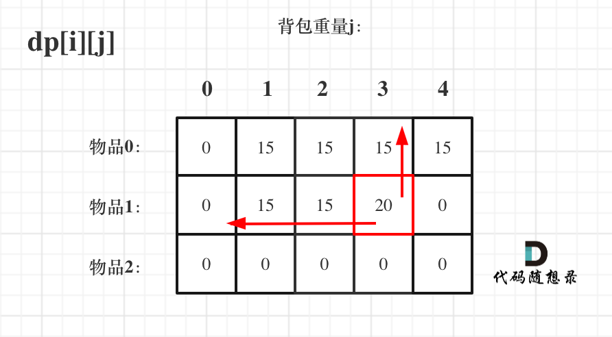

# 背包问题


## 0-1背包


N个物品，背包容量为M

每个物品体积vi，价值wi，选或者不选

目标：选择物品使得不超过背包容量前提下价值最大

### 二维方法

参考：https://programmercarl.com/%E8%83%8C%E5%8C%85%E7%90%86%E8%AE%BA%E5%9F%BA%E7%A1%8001%E8%83%8C%E5%8C%85-1.html#%E5%85%B6%E4%BB%96%E8%AF%AD%E8%A8%80%E7%89%88%E6%9C%AC

先搞清楚二维怎么做

dp[i] [j]表示从下标为[0-i]的物品里任意取，放进容量为j的背包，价值总和最大是多少。

**dp[i] [j]的计算：**

- 不包含i：dp[i-1] [j]
- 包含i：dp[i-1] [j-vi] + wi

**初始化：**

dp[0] [i]表示不放物品，因此都应该为0


**遍历顺序：**

两种遍历顺序（先i,再j或者先j再i）都可以




#### 代码

```java
import java.util.*;
public class Main{
    public static void main(String[] args){
        Scanner sc = new Scanner(System.in);
        String[] s = sc.nextLine().split(" ");
        int N = Integer.parseInt(s[0]), M = Integer.parseInt(s[1]);
        int[] v = new int[N + 1]; //体积
        int[] w = new int[N + 1]; //价值
        for(int i = 1; i <= N; i++){
            s = sc.nextLine().split(" ");
            v[i] = Integer.parseInt(s[0]);
            w[i] = Integer.parseInt(s[1]);
        }
        int[][] dp = new int[N + 1][M + 1];
        for(int i = 1; i <= N; i++){
            for(int j = 0; j <= M; j++){
                if(j >= v[i]){
                    //放得下
                    dp[i][j] = Math.max(dp[i-1][j], dp[i-1][j-v[i]] + w[i]);
                }else{
                    dp[i][j] = dp[i-1][j];
                }
            }
        }
        System.out.print(dp[N][M]);
    }
}
```

下面这种是竞赛常见写法，不用管要开多少大小数组，直接看数据量，这样容错大

```java
import java.util.*;
public class Main{
    static final int N = 1010;
    static int[] v = new int[N]; //体积
    static int[] w = new int[N]; //价值
    static int[][] dp = new int[N][N];
    public static void main(String[] args){
        Scanner sc = new Scanner(System.in);
        String[] s = sc.nextLine().split(" ");
        int n = Integer.parseInt(s[0]), m = Integer.parseInt(s[1]);
        
        for(int i = 1; i <= n; i++){
            s = sc.nextLine().split(" ");
            v[i] = Integer.parseInt(s[0]);
            w[i] = Integer.parseInt(s[1]);
        }
        
        for(int i = 1; i <= n; i++){
            for(int j = 0; j <= m; j++){
                if(j >= v[i]){
                    //放得下
                    dp[i][j] = Math.max(dp[i-1][j], dp[i-1][j-v[i]] + w[i]);
                }else{
                    dp[i][j] = dp[i-1][j];
                }
            }
        }
        System.out.print(dp[n][m]);
    }
}
```

### 一维优化

利用滚动数组进行优化

需要注意的一点是内层循环应该从后往前遍历因为dp[j-v[i]]实质上是dp[i-1] [j-v[i]]如果从v[i]往m遍历，那么此时的dp[j-v[i]]实质上是dp[i] [j-v[i]]

```java
for(int i = 1; i <= n; i++){
    for(int j = m; j >= v[i]; j--){
        dp[j] = Math.max(dp[j], dp[j-v[i]] + w[i]);
    }
}
```

#### 代码

```java
import java.util.*;
public class Main{
    static final int N = 1010;
    static int[] v = new int[N]; //体积
    static int[] w = new int[N]; //价值
    static int[] dp = new int[N];
    public static void main(String[] args){
        Scanner sc = new Scanner(System.in);
        String[] s = sc.nextLine().split(" ");
        int n = Integer.parseInt(s[0]), m = Integer.parseInt(s[1]);
        for(int i = 1; i <= n; i++){
            s = sc.nextLine().split(" ");
            v[i] = Integer.parseInt(s[0]);
            w[i] = Integer.parseInt(s[1]);
        }
        
        for(int i = 1; i <= n; i++){
            for(int j = m; j >= v[i]; j--){
                dp[j] = Math.max(dp[j], dp[j-v[i]] + w[i]);
            }
        }
        System.out.print(dp[m]);
    }
}
```

# 路径问题

经典题目

## 摘花生

Hello Kitty想摘点花生送给她喜欢的米老鼠。

她来到一片有网格状道路的矩形花生地(如下图)，从西北角进去，东南角出来。

地里每个道路的交叉点上都有种着一株花生苗，上面有若干颗花生，经过一株花生苗就能摘走该它上面所有的花生。

Hello Kitty只能向东或向南走，不能向西或向北走。

问Hello Kitty最多能够摘到多少颗花生。


### 输入格式

第一行是一个整数T，代表一共有多少组数据。

接下来是T组数据。

每组数据的第一行是两个整数，分别代表花生苗的行数R和列数 C。

每组数据的接下来R行数据，从北向南依次描述每行花生苗的情况。每行数据有C个整数，按从西向东的顺序描述了该行每株花生苗上的花生数目M。

### 输出格式

对每组输入数据，输出一行，内容为Hello Kitty能摘到得最多的花生颗数。

### 数据范围

1≤T≤1001≤T≤100,
1≤R,C≤1001≤R,C≤100,
0≤M≤10000≤M≤1000

### 输入样例：

```
2
2 2
1 1
3 4
2 3
2 3 4
1 6 5
```

### 输出样例：

```
8
16
```

### 思路

- 初始化：这道题求最大，初始化可以忽略，保险还是加上初始化边界
- 关键在于分析出`dp[i][j] = Math.max(dp[i-1][j],dp[i][j-1]) + mat[i][j];`即`dp[i][j]`的取值从上面或者左边取最大+`mat[i][j]`

### 代码

```java
import java.util.*;
import java.io.*;
public class Main{
    static BufferedReader br = new BufferedReader(new InputStreamReader(System.in));
    public static void main(String[] args) throws IOException{
        int T = Integer.parseInt(br.readLine());
        while(T-- > 0){
            String[] init = br.readLine().split(" ");
            int n = Integer.parseInt(init[0]);
            int m = Integer.parseInt(init[1]);
            int[][] mat = new int[n+1][m+1];
            for(int i = 1; i <= n; i++){
                String[] data = br.readLine().split(" ");
                for(int j = 1; j <= m; j++){
                    mat[i][j] = Integer.parseInt(data[j-1]);
                }
            }
            int[][] dp = new int[n+1][m+1];
            for(int i = 1; i <= n; i++){
                for(int j = 1; j <= m; j++){
                    dp[i][j] = Math.max(dp[i-1][j],dp[i][j-1]) + mat[i][j];
                }
            }
            System.out.println(dp[n][m]);
        }
    }
}
```

## 数字三角形

给定一个如下图所示的数字三角形，从顶部出发，在每一结点可以选择移动至其左下方的结点或移动至其右下方的结点，一直走到底层，要求找出一条路径，使路径上的数字的和最大。

```
        7
      3   8
    8   1   0
  2   7   4   4
4   5   2   6   5
```

### 输入格式

第一行包含整数 nn，表示数字三角形的层数。

接下来 nn 行，每行包含若干整数，其中第 ii 行表示数字三角形第 ii 层包含的整数。

### 输出格式

输出一个整数，表示最大的路径数字和。

### 数据范围

1≤n≤5001≤n≤500,
−10000≤三角形中的整数≤10000−10000≤三角形中的整数≤10000

### 输入样例：

```
5
7
3 8
8 1 0 
2 7 4 4
4 5 2 6 5
```

### 输出样例：

```
30
```

### 思路

从下往上遍历，可以省去很多条件判断

### 代码

```java
import java.util.*;
public class Main{
    static Scanner sc = new Scanner(System.in);
    static final int N = 510;
    static int[][] w = new int[N][N];
    static int[][] dp = new int[N][N];
    public static void main(String[] args){
        int n = sc.nextInt();
        for(int i = 1; i <= n; i++){
            for(int j = 1; j <= i; j++){
                w[i][j] = sc.nextInt();
            }
        }
        for(int i = n; i >= 1; i--){
            for(int j = 1; j <= i; j++){
                dp[i][j] = Math.max(dp[i+1][j],dp[i+1][j+1]) + w[i][j];
            }
        }
        System.out.print(dp[1][1]);
    }
}
```

# 最长上升子序列问题 LIS

给定一个长度为 NN 的数列，求数值严格单调递增的子序列的长度最长是多少。

#### 输入格式

第一行包含整数 NN。

第二行包含 NN 个整数，表示完整序列。

#### 输出格式

输出一个整数，表示最大长度。

#### 数据范围

1≤N≤10001≤N≤1000，
−109≤数列中的数≤109−109≤数列中的数≤109

#### 输入样例：

```
7
3 1 2 1 8 5 6
```

#### 输出样例：

```
4
```

#### 代码

```java
import java.util.*;
public class Main{
    static Scanner sc = new Scanner(System.in);
    public static void main(String[] args){
        int N = sc.nextInt();
        int[] arr = new int[N + 1];
        for(int i = 1; i <= N; i++){
            arr[i] = sc.nextInt();
        }
        int[] dp = new int[N + 1]; //dp[i]表示前i个数的LIS
        Arrays.fill(dp,1);
        int max = 1;
        for(int i = 1; i <= N; i++){
            for(int j = 1; j < i; j++){
                if(arr[i] > arr[j]){
                    dp[i] = Math.max(dp[i],dp[j] + 1);
                    max = Math.max(max,dp[i]);
                } 
            }   
        }
        System.out.print(max);
    }
}
```

