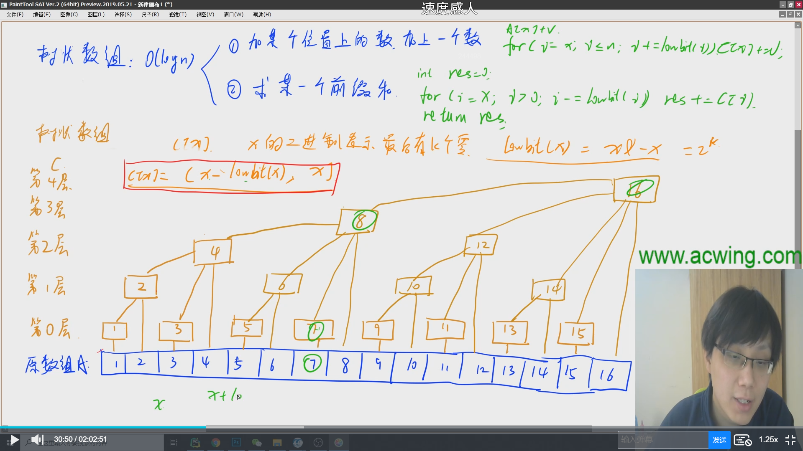

# 树状数组与线段树

## 树状数组

- 单点修改
- 区间查询



三个重要的函数

- `int lowBit(int x)` 返回当前下标在第几层
- `void add(int x, int v) `将树状数组与下标x有关联的部分都加上修改的差值v
- `int query(int x)` 查询[1,x]区间前缀和

```java
public static int lowBit(int x){
        return x & -x;
    }
    public static void add(int x, int v){
        for(int i = x; i <= n; i += lowBit(i)) tr[i] += v;
    }
    public static int query(int x){
        int res = 0;
        for(int i = x; i > 0; i -= lowBit(i)) res += tr[i];
        return res;
    }
```

### 树状数组板子

```java
import java.util.*;
import java.io.*;
public class Main{
    static BufferedReader br = new BufferedReader(new InputStreamReader(System.in));
    static BufferedWriter bw = new BufferedWriter(new OutputStreamWriter(System.out));
    static int N = 100010;
    static int n;
    static int m;
    static int[] arr = new int[N];
    static int[] tr = new int[N];
    //返回层数
    public static int lowBit(int x){
        return x & -x;
    }
    //修改树状数组
    public static void add(int x, int v){
        for(int i = x; i <= n; i += lowBit(i)) tr[i] += v;
    }
    //返回前缀和
    public static int query(int x){
        int res = 0;
        for(int i = x; i > 0; i -= lowBit(i)) res += tr[i];
        return res;
    }
    public static void main(String[] args) throws IOException{
        String[] init = br.readLine().split(" ");
        n = Integer.parseInt(init[0]);
        m = Integer.parseInt(init[1]);
        String[] data = br.readLine().split(" ");
        //初始化
        for(int i = 1; i <= n; i++){
            arr[i] = Integer.parseInt(data[i-1]);
            add(i,arr[i]);
        } 
        while(m-- > 0){
            data = br.readLine().split(" ");
            int k = Integer.parseInt(data[0]);
            int a = Integer.parseInt(data[1]);
            int b = Integer.parseInt(data[2]);
            if(k == 0){
                //返回区间和
                System.out.println(query(b) - query(a-1));
            }else{
                add(a,b);
            }
        }
    }
}
```

