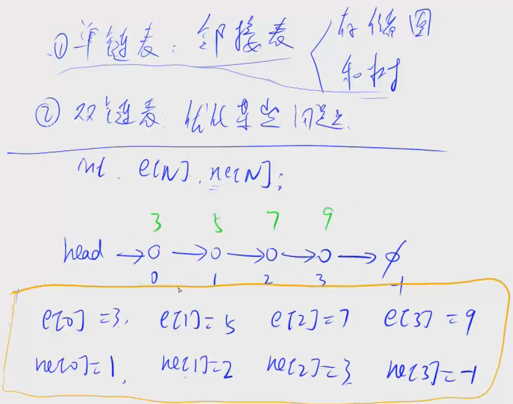
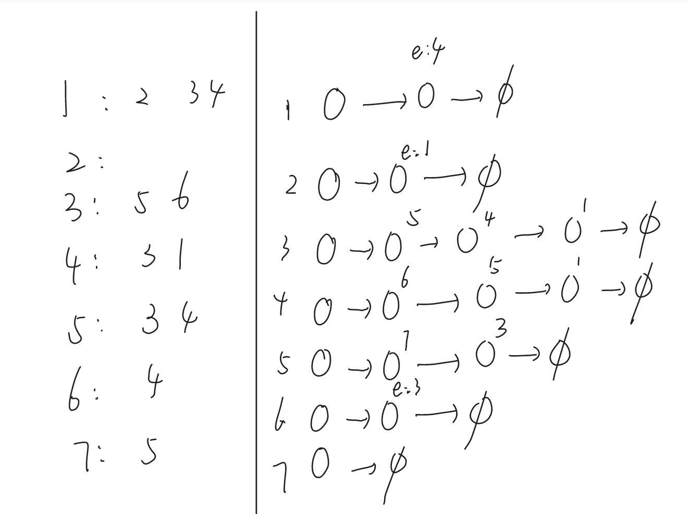

# 邻接表

两种实现方式，一种是vector一种是单链表

## vector实现

在java中使用`ArrayList`

待补充

## 单链表（链式前向星）



### 单链表

实现一个单链表，链表初始为空，支持三种操作：

1. 向链表头插入一个数；
2. 删除第 k 个插入的数后面的数；
3. 在第 k 个插入的数后插入一个数。

现在要对该链表进行 M 次操作，进行完所有操作后，从头到尾输出整个链表。

**注意**:题目中第 k 个插入的数并不是指当前链表的第 k 个数。例如操作过程中一共插入了 n 个数，则按照插入的时间顺序，这 n 个数依次为：第 11 个插入的数，第 22 个插入的数，…第 n 个插入的数。

#### 输入格式

第一行包含整数 M，表示操作次数。

接下来 M 行，每行包含一个操作命令，操作命令可能为以下几种：

1. `H x`，表示向链表头插入一个数 x。
2. `D k`，表示删除第 k 个插入的数后面的数（当 k 为 00 时，表示删除头结点）。
3. `I k x`，表示在第 k 个插入的数后面插入一个数 x（此操作中 k 均大于 00）。

#### 输出格式

共一行，将整个链表从头到尾输出。

#### 数据范围

1≤M≤1000001≤≤100000
所有操作保证合法。

#### 输入样例：

```
10
H 9
I 1 1
D 1
D 0
H 6
I 3 6
I 4 5
I 4 5
I 3 4
D 6
```

#### 输出样例：

```
6 4 6 5
```

#### 代码

```java
import java.util.*;
import java.io.*;
public class Main{
    static BufferedReader br = new BufferedReader(new InputStreamReader(System.in));
    static Scanner sc = new Scanner(System.in);
    static int head;
    static int N = 100010;
    static int[] e = new int[N]; //存储某个结点的值
    static int[] ne = new int[N]; //存结点指向的下一个结点
    static int idx; //当前的结点下标
    
    // 初始化
    public static void init(){
        head = -1;
        idx = 0;
    }
    // 向头结点插入一个值
    public static void add_to_head(int x){
        e[idx] = x;
        ne[idx] = head;
        head = idx;
        idx++;
    }
    // 向下标为k的结点后插入一个数x
    public static void add(int k, int x){
        e[idx] = x;
        ne[idx] = ne[k];
        ne[k] = idx;
        idx++;
    }
    // 移除下标为k后的一个结点
    public static void remove(int k){
        ne[k] = ne[ne[k]];
    }
    public static void main(String[] args) throws IOException{
        init();
        int n = Integer.parseInt(br.readLine());
        while(n-- > 0){
            String[] data = br.readLine().split(" ");
            char c = data[0].charAt(0);
            int x = 0, k = 0;
            if(c == 'H'){
                x = Integer.parseInt(data[1]);
                add_to_head(x);
            }else if(c == 'I'){
                k = Integer.parseInt(data[1]);
                x = Integer.parseInt(data[2]);
                add(k-1,x);
            }else{
                k = Integer.parseInt(data[1]);
                if(k == 0) head = ne[head];
                else remove(k-1);
            }
        }
        for(int i = head; i != -1; i = ne[i]){
            System.out.print(e[i] + " ");
        }
    }
}
```


### 图

每一个结点都形成一个单链表

有向图

用于社交网络的建图

#### 关键代码

初始化

```java
Arrays.fill(h,-1);
```

添加

```java
// 把b加到a链表里面
public static void add(int a, int b){
    e[idx] = b; ne[idx] = h[a]; h[a] = idx++;
}
```

遍历

```java
for(int j = h[t]; j != -1; j = ne[j]){
}
```

#### 例题1562. 微博转发

微博被称为中文版的 Twitter。

微博上的用户既可能有很多关注者，也可能关注很多其他用户。

因此，形成了一种基于这些关注关系的社交网络。

当用户在微博上发布帖子时，他/她的所有关注者都可以查看并转发他/她的帖子，然后这些人的关注者可以对内容再次转发…

现在给定一个社交网络，假设只考虑 L 层关注者，请你计算某些用户的帖子的最大可能转发量。

##### 补充

如果 B 是 A 的关注者，C 是 B 的关注者，那么 A 的第一层关注者是 B，第二层关注者是 C。

##### 输入格式

第一行包含两个整数，N 表示用户数量，L 表示需要考虑的关注者的层数。

假设，所有的用户的编号为 1∼N1∼。

接下来 N 行，每行包含一个用户的关注信息，格式如下：

```
M[i] user_list[i]
```

`M[i]` 是第 i 名用户关注的总人数，`user_list[i]` 是第 i 名用户关注的 `M[i]` 个用户的编号列表。

最后一行首先包含一个整数 K，表示询问次数，然后包含 K 个用户编号，表示询问这些人的帖子的最大可能转发量。

##### 输出格式

按顺序，每行输出一个被询问人的帖子最大可能转发量。

假设每名用户初次看到帖子时，都会转发帖子，只考虑 L 层关注者。

##### 数据范围

1≤N≤10001≤≤1000,
1≤L≤61≤≤6,
1≤M[i]≤1001≤[]≤100,
1≤K≤N1≤≤

##### 输入样例：

```
7 3
3 2 3 4
0
2 5 6
2 3 1
2 3 4
1 4
1 5
2 2 6
```

##### 输出样例：

```
4
5
```

##### 建图过程

将每个点和他的粉丝相连，其实就是给每个点建立一个粉丝链表



```java
import java.util.*;
public class Main{
    static Scanner sc = new Scanner(System.in);
    static int N = 1010, M = 100010; //N是点 M是边
    static int n,L,K,idx;
    static int[] h = new int[N], e = new int[M], ne = new int[M]; //建图
    static boolean[] st = new boolean[N];//判断是否遍历到
    // 把b加到a链表里面
    public static void add(int a, int b){
        e[idx] = b; ne[idx] = h[a]; h[a] = idx++;
    }
    // 查询
    public static int bfs(int start){
        //每次访问都需要初始化
        Queue<Integer> que = new LinkedList<>();
        Arrays.fill(st,false);
        st[start] = true;
        que.offer(start);
        int res = 0;
        // 最多L层
        for(int i = 0; i < L; i++){
            int sz = que.size();
            while(sz-- > 0){
                int t = que.poll();
                for(int j = h[t]; j != -1; j = ne[j]){
                    int x = e[j];
                    if(!st[x]){
                        res++;
                        que.offer(x);
                        st[x] = true;
                    }
                }
            }
        }
        return res;
    }
    public static void main(String[] args){
        n = sc.nextInt();
        L = sc.nextInt();
        Arrays.fill(h,-1);
        for(int i = 1; i <= n; i++){
            int cnt = sc.nextInt();
            while(cnt-- > 0){
                int x = sc.nextInt();
                add(x,i);
            }
        }
        K = sc.nextInt();
        while(K-- > 0){
            int m = sc.nextInt();
            System.out.println(bfs(m));
        }
    }
}
```

#### 权值

https://www.acwing.com/problem/content/1209/

```java
static int N = 100010, M = 200010;
static int idx = 0;
// 单链表四要素
static int[] h = new int[N];
static int[] e = new int[M];
static int[] ne = new int[M];
static int[] w = new int[M];

public static void add(int a, int b, int c){
    e[idx] = b; w[idx] = c; ne[idx] = h[a]; h[a] = idx++;
}

for(int i = h[cur]; i != -1; i = ne[i]){
    int j = e[i];
    if(st[j]) continue;
    st[j] = true;
    dist[j] = dist[cur] + w[i]; // 距离 = (x -> cur) + (cur -> j)
    que.offer(j);
}
```

