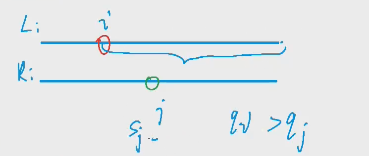

## 归并排序

思想是分治

将排序好的两部分进行合并

注意：最后需要将temp[]数组重新赋值回arr

```java
import java.util.*;
public class Main{
    static Scanner sc = new Scanner(System.in);
    static int N = 100010;
    static int[] arr = new int[N];
    static int[] temp = new int[N];
    public static void merge_sort(int[] arr, int l, int r){
        if(l >= r) return;
        int mid = (l+r) >> 1;
        merge_sort(arr,l,mid);
        merge_sort(arr,mid+1,r);
        int i = l, j = mid+1;
        int k = 0;
        while(i <= mid && j <= r){
            if(arr[i] <= arr[j]) temp[k++] = arr[i++];
            else temp[k++] = arr[j++];
        }
        while(i <= mid) temp[k++] = arr[i++];
        while(j <= r) temp[k++] = arr[j++];
        for(i = l, j = 0; i <= r; i++,j++) arr[i] = temp[j];
    }
    public static void main(String[] args){
        int n = sc.nextInt();
        for(int i = 0; i < n; i++) arr[i] = sc.nextInt();
        merge_sort(arr,0,n-1);
        for(int i = 0; i < n; i++) System.out.print(arr[i] + " ");
    }
}
```


## 求逆序对板子

关键在于合并的时候统计逆序对

```java
while(i <= mid && j <= r){
    if(arr[i] <= arr[j]) temp[k++] = arr[i++];
    else{
        res += mid - i + 1;
        temp[k++] = arr[j++];
    }
}
```




```java
import java.util.*;
public class Main{
    static Scanner sc = new Scanner(System.in);
    static int N = 100010;
    static int[] arr = new int[N];
    static int[] temp = new int[N];
    public static void main(String[] args){
        int n = sc.nextInt();
        for(int i = 0; i < n; i++) arr[i] = sc.nextInt();
        System.out.print(merge_sort(0,n-1));
    }
    public static long merge_sort(int l ,int r){
        if(l >= r) return 0;
        int mid = l + r >> 1;
        long res = merge_sort(l,mid) + merge_sort(mid+1,r);
        int k = 0, i = l, j = mid + 1;
        while(i <= mid && j <= r){
            if(arr[i] <= arr[j]) temp[k++] = arr[i++];
            else{
                res += mid - i + 1;
                temp[k++] = arr[j++];
            }
        }
        while(i <= mid) temp[k++] = arr[i++];
        while(j <= r) temp[k++] = arr[j++];
        //恢复
        for(i = l, j = 0; i <= r; i++,j++) arr[i] = temp[j];
        return res;
    }
}
```


