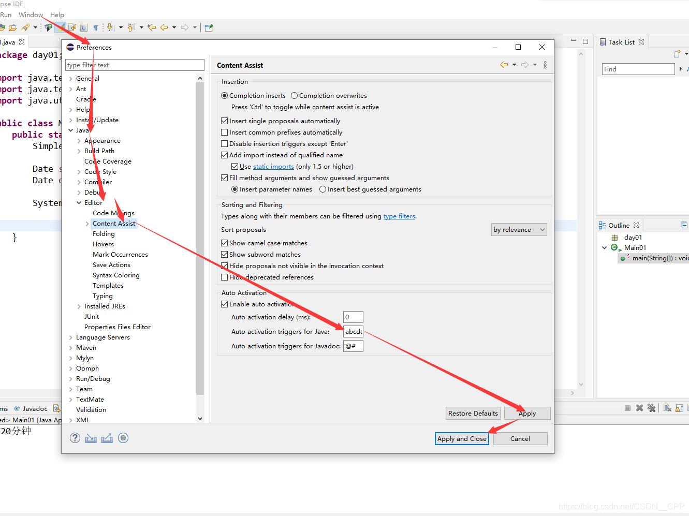
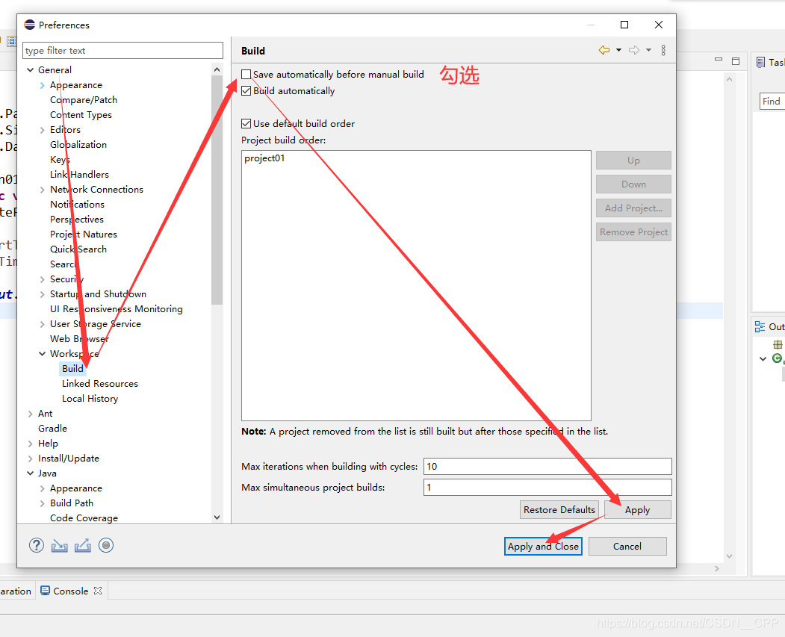
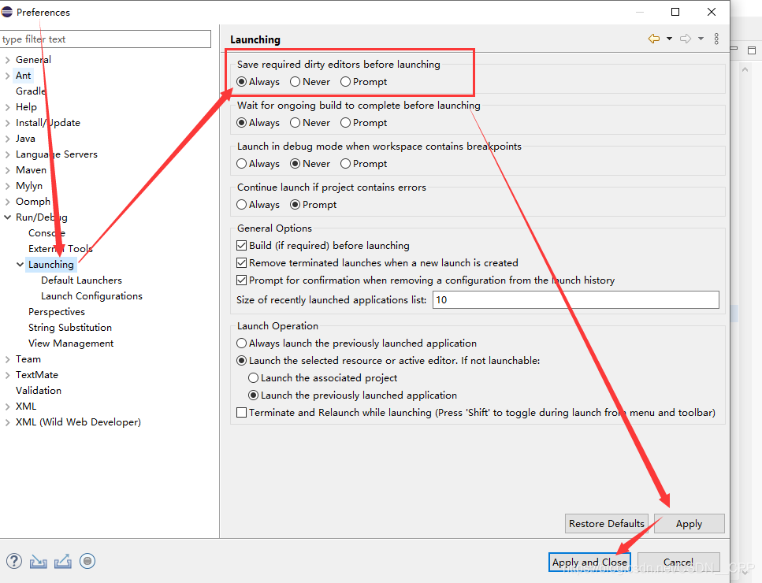
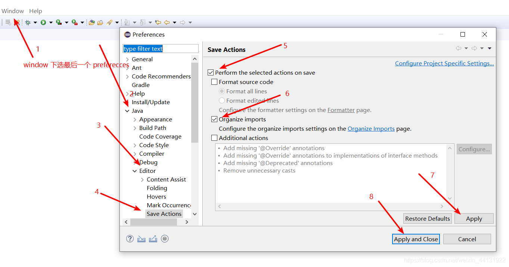
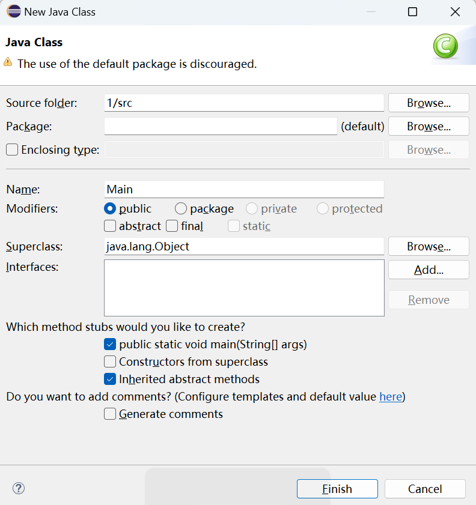
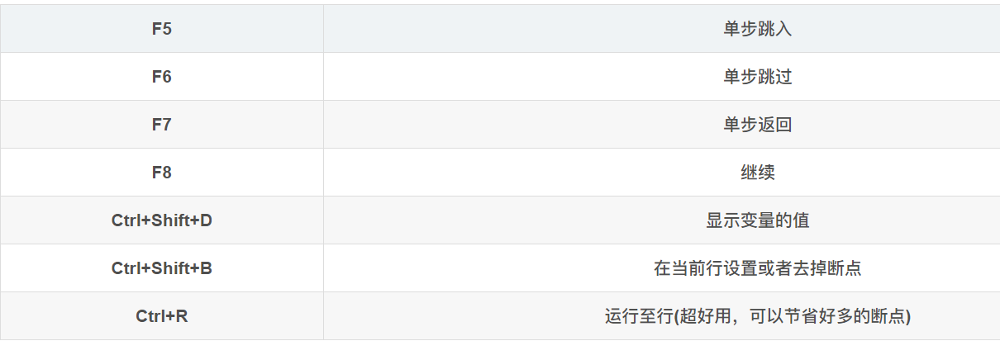

# Eclipse配置及使用

参考博客：[Eclipse使用技巧总览（基于蓝桥杯2021官方指定Java组2020-06版本）](https://blog.csdn.net/CSDN__CPP/article/details/114778994?ops_request_misc=%257B%2522request%255Fid%2522%253A%2522168050670416800188519783%2522%252C%2522scm%2522%253A%252220140713.130102334..%2522%257D&request_id=168050670416800188519783&biz_id=0&utm_medium=distribute.pc_search_result.none-task-blog-2~all~sobaiduend~default-4-114778994-null-null.142^v81^insert_down38,201^v4^add_ask,239^v2^insert_chatgpt&utm_term=%E8%93%9D%E6%A1%A5%E6%9D%AFeclipse%E7%9A%84%E4%BD%BF%E7%94%A8&spm=1018.2226.3001.4187)

注意蓝桥杯官方指定Java 开发环境：JDK 1.8、Eclipse-java-2020-06、API 帮助文档

Eclipse直接前往官网下载即可

链接：https://dasai.lanqiao.cn/notices/1096/

## 配置篇

众所周知，Eclipse难用的一批。。。

目前Eclipse的默认逻辑是遇到.才会进行代码提示

因此需要修改逻辑为输入就提示，提高效率



代码自动保存





自动导包



## 使用篇

### 创建项目

注意不要把package复制进最终答案里

`New Project` -> `java project` ->`New Class`



### 快捷键

- `AlT + /` 代码提示

- `alt+↑\↓`：该行向上\下移动
- syso：`System.out.println();`
- main:

```jav
public static void main(String[] args) {

}
```

- `f11`：debug
- `ctrl+f11`：运行
- `ctrl+R`：运行至此行

### 调试




