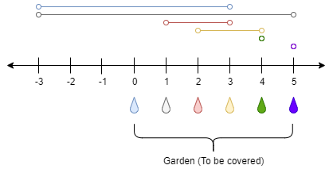

# 跳跃问题

判断能否从数轴的最左端跳跃到最右边

变形：最少跳跃次数

### 45.跳跃游戏

[题目链接](https://leetcode.cn/problems/jump-game/description/)

给定一个非负整数数组 `nums` ，你最初位于数组的 **第一个下标** 。

数组中的每个元素代表你在该位置可以跳跃的最大长度。

判断你是否能够到达最后一个下标。

 

**示例 1：**

```
输入：nums = [2,3,1,1,4]
输出：true
解释：可以先跳 1 步，从下标 0 到达下标 1, 然后再从下标 1 跳 3 步到达最后一个下标。
```

**示例 2：**

```
输入：nums = [3,2,1,0,4]
输出：false
解释：无论怎样，总会到达下标为 3 的位置。但该下标的最大跳跃长度是 0 ， 所以永远不可能到达最后一个下标。
```

 

**提示：**

- `1 <= nums.length <= 3 * 104`
- `0 <= nums[i] <= 105`

**思路**

维护一个当前能到达的最右端点right

遍历nums数组，不断更新right，如果right >= n-1则表示能到达终点

**代码**

```java
class Solution {
    public boolean canJump(int[] nums) {
        int n = nums.length;
        int right = 0;
        //判断能否到终点
        for(int i = 0; i <= right; i++){
            right = Math.max(right,nums[i]+i);
            if(right >= n - 1) return true;
        }
        return false;
    }
}
```

### 55.跳跃游戏2

[题目链接](https://leetcode.cn/problems/jump-game-ii/submissions/404600292/****)

给定一个长度为 `n` 的 **0 索引**整数数组 `nums`。初始位置为 `nums[0]`。

每个元素 `nums[i]` 表示从索引 `i` 向前跳转的最大长度。换句话说，如果你在 `nums[i]` 处，你可以跳转到任意 `nums[i + j]` 处:

- `0 <= j <= nums[i]` 
- `i + j < n`

返回到达 `nums[n - 1]` 的最小跳跃次数。生成的测试用例可以到达 `nums[n - 1]`。

 

**示例 1:**

```
输入: nums = [2,3,1,1,4]
输出: 2
解释: 跳到最后一个位置的最小跳跃数是 2。
     从下标为 0 跳到下标为 1 的位置，跳 1 步，然后跳 3 步到达数组的最后一个位置。
```

**示例 2:**

```
输入: nums = [2,3,0,1,4]
输出: 2
```

 

**提示:**

- `1 <= nums.length <= 104`
- `0 <= nums[i] <= 1000`
- 题目保证可以到达 `nums[n-1]`

**思路**：

贪心思想，维护每个位置能到达的最右端点，当到达最右端点时跳跃次数加一，如果cur == next，则表示无法跳跃，返回-1（本题保证可以到达，所以可以省略这一步）

**代码：**

```java
class Solution {
    public int jump(int[] nums) {
        int n = nums.length;
        int res = 0;
        int cur = 0; //表示当前能到达的右端点
        int next = 0; //表示下一个能到达的右端点
        for(int i = 0; i < n - 1; i++){
            next = Math.max(next,nums[i] + i);
            //当前已经到当前边界
            if(i == cur){
                cur = next;
                res++;
            }
        }
        return res;
    }
}
```

### 1326. 灌溉花园的最少水龙头数目

在 x 轴上有一个一维的花园。花园长度为 `n`，从点 `0` 开始，到点 `n` 结束。

花园里总共有 `n + 1` 个水龙头，分别位于 `[0, 1, ..., n]` 。

给你一个整数 `n` 和一个长度为 `n + 1` 的整数数组 `ranges` ，其中 `ranges[i]` （下标从 0 开始）表示：如果打开点 `i` 处的水龙头，可以灌溉的区域为 `[i - ranges[i], i + ranges[i]]` 。

请你返回可以灌溉整个花园的 **最少水龙头数目** 。如果花园始终存在无法灌溉到的地方，请你返回 **-1** 。

 

**示例 1：**



```
输入：n = 5, ranges = [3,4,1,1,0,0]
输出：1
解释：
点 0 处的水龙头可以灌溉区间 [-3,3]
点 1 处的水龙头可以灌溉区间 [-3,5]
点 2 处的水龙头可以灌溉区间 [1,3]
点 3 处的水龙头可以灌溉区间 [2,4]
点 4 处的水龙头可以灌溉区间 [4,4]
点 5 处的水龙头可以灌溉区间 [5,5]
只需要打开点 1 处的水龙头即可灌溉整个花园 [0,5] 。
```

**示例 2：**

```
输入：n = 3, ranges = [0,0,0,0]
输出：-1
解释：即使打开所有水龙头，你也无法灌溉整个花园。
```

 

**提示：**

- `1 <= n <= 104`
- `ranges.length == n + 1`
- `0 <= ranges[i] <= 100`

**思路**

这一题需要经过预处理，先通过题意求出right数组，表示每个位置能到达的最远右端点

**代码：**

```java
class Solution {
    public int minTaps(int n, int[] ranges) {
        //求出每个位置可以到达的最远右端点
        int[] right = new int[n+1];
        for(int i = 0; i <= n; i++){
            int r = ranges[i];
            if(i > r){
                //左端点是i-r
                right[i-r] = i + r;
            }else{
                //可以覆盖0
                right[0] = Math.max(right[0],i+r);
            }
        }
        //记录跳跃次数
        int cur = 0;
        int next = 0;
        int ans = 0;
        for(int i = 0; i < n; i++){
            next = Math.max(next,right[i]);
            if(i == cur){
                //到右端点
                if(cur == next){
                    return -1;
                }else{
                    cur = next;
                    ans++;
                }
            }
        }
        return ans;
    }
}
```

补充练习

- [1024.视频拼接](https://leetcode.cn/problems/video-stitching/submissions/404611902/)

参考代码：

注意本题的clips数据可能会超过time，需要进行过滤

```java
class Solution {
    public int videoStitching(int[][] clips, int time) {
        int[] right = new int[time+2];
        for(int i = 0; i <= time; i++){
            right[i] = i;
        }
        Arrays.sort(clips,(o1,o2) -> o1[0] == o2[0] ? o1[1] - o2[1] : o1[0] - o2[0]);
        for(int[] cl : clips){
            int l = cl[0];
            int r = cl[1];
            if(l > time) continue;
            right[l] = Math.max(right[l],r);
        }
        int cur = 0;
        int next = 0;
        int res = 0;
        for(int i = 0 ; i < time; i++){
            next = Math.max(next,right[i]);
            if(i == cur){
                if(cur == next){
                    return -1;
                }else{
                    cur = next;
                    res++;
                }
            }
        }
        return res;
    }
}
```

