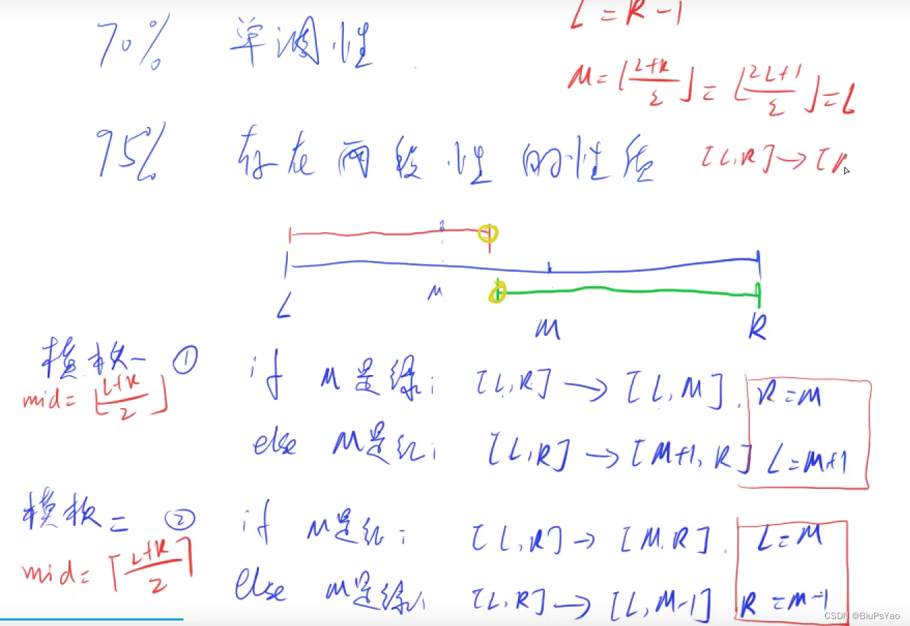

# 二分套路

y总模板

b站链接：https://www.bilibili.com/video/BV1Ft41157zW/?spm_id_from=333.1007.top_right_bar_window_history.content.click&vd_source=5500fef761fd3ab451b9bbe518cd5cc6



模板一

```java
int bsearch_1(int l, int r)
{
    while (l < r)
    {
        int mid =  l + r >> 1; //除2 操作 
        if (check(mid)) r = mid; //check函数即为边界的选择
        else l = mid + 1;
    }
    return l; //l r都可以，跳出while r = l
}

```

模板二

```java
int bsearch_2(int l, int r)
{
    while (l < r)
    {
        int mid = l + r + 1 >> 1; //注意+1操作
        if (check(mid)) l = mid;
        else r = mid - 1;
    }
    return l;
}

```

## 实战

### lc.x的平方根

https://leetcode.cn/problems/sqrtx/description/

```java
class Solution {
    public int mySqrt(int x) {
        //套y神模板
        int l = 0, r = x;
        while(l < r){
            int mid = (l + r + 1) >> 1;
            if(mid <= x / mid){
                l = mid;
            }else{
                r = mid - 1;
            }
        }
        return r;
    }
}
```


### lc74 搜索二维矩阵

 https://leetcode.cn/problems/search-a-2d-matrix/

```java
class Solution {
    public boolean searchMatrix(int[][] matrix, int target) {
        //使用y神模板
        if(matrix == null || matrix.length == 0) return false;
        int n = matrix.length, m = matrix[0].length;
        int l = 0, r = n * m - 1;
        while(l < r){
            int mid = (l + r) >> 1;
            if(matrix[mid / m][mid % m] >= target){
                r = mid;
            }else{
                l = mid + 1;
            }
        }
        if(matrix[r / m][r % m] != target) return false;
        return true;
    }
}
```

### lc35 搜索插入位置

https://leetcode.cn/problems/search-insert-position/description/

```java
public int searchInsert(int[] nums, int target) {
        //O(logn)很明显的二分
        int l = 0,r = nums.length;
        while(l < r){
            int mid = (l + r) >> 1;
            if(nums[mid] >= target){
                r = mid;
            }else{
                l = mid + 1;
            }
        }
        return r;
    }
```

### lc34. 在排序数组中查找元素的第一个和最后一个位置

https://leetcode.cn/problems/find-first-and-last-position-of-element-in-sorted-array/description/

```java
class Solution {
    public int[] searchRange(int[] nums, int target) {
        //O(logn)二分
        //两个模板一起用
        if(nums.length == 0 || nums == null) return new int[]{-1,-1};
        int l = 0, r = nums.length - 1;
        //先找start
        while(l < r){
            int mid = (l + r) >> 1;
            if(nums[mid] >= target){
                r = mid;
            }else{
                l = mid + 1;
            }
        }
        if(nums[r] != target) return new int[]{-1,-1};
        int start = r;
        //找end
        l = 0;
        r = nums.length - 1;
        while(l < r){
            int mid = (l + r + 1) >> 1;
            if(nums[mid] <= target){
                l = mid;
            }else{
                r = mid - 1;
            }
        }
        int end = l;
        return new int[]{start,end};
    }
}
```

### lc153. 寻找旋转排序数组中的最小值

https://leetcode.cn/problems/find-minimum-in-rotated-sorted-array/description/

```java
class Solution {
    public int findMin(int[] nums) {
        //找一个状态能够二段性
        int n = nums.length;
        int l = 0, r = n - 1;
        while(l < r){
            int mid = (l + r) >> 1;
            if(nums[mid] < nums[n - 1]){
                r = mid;
            }else{
                l = mid + 1;
            }
        }
        return nums[l];
    }
}
```

### lc33 搜索旋转排序数组

https://leetcode.cn/problems/search-in-rotated-sorted-array/description/

```java
class Solution {
    public int search(int[] nums, int target) {
        //先找出最小值的下标
        int minIndex = findMinIndex(nums);
        System.out.println(minIndex);
        if(target <= nums[nums.length - 1]){
            //后半段
            return binarySearch(nums,target,minIndex,nums.length - 1);
        }else{
            //前半段
            return binarySearch(nums,target,0,minIndex - 1);
        }
    }
    public int binarySearch(int[] nums, int target, int left, int right){
        int l = left, r = right;
        while(l < r){
            int mid = (l + r) >> 1;
            if(nums[mid] >= target){
                r = mid;
            }else{
                l = mid + 1;
            }
        }
        System.out.println(l);
        if(nums[l] == target) return l;
        return -1;
    }
    public int findMinIndex(int[] nums) {
        //找一个状态能够二段性
        int n = nums.length;
        int l = 0, r = n - 1;
        while(l < r){
            int mid = (l + r) >> 1;
            if(nums[mid] < nums[n - 1]){
                r = mid;
            }else{
                l = mid + 1;
            }
        }
        return l;
    }
}
```

- 总结nums[mid] >= target可以用于找第一个出现的target值 不存在则返回-1
- nums[mid] <= target可以用于找最后一个出现的target值 不存在则返回-1