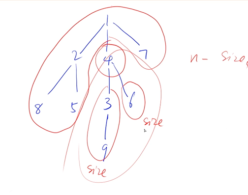
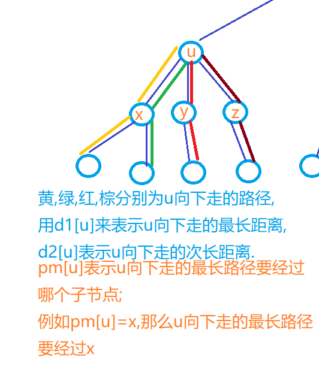
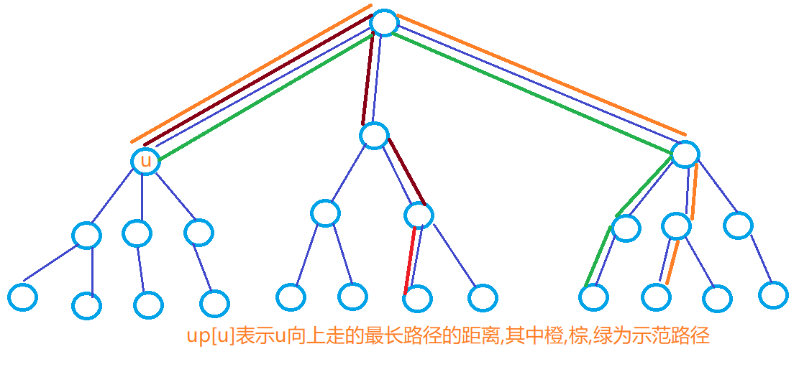

# 背包DP


## 0-1背包


`f[i][j] `

- 状态表示：前i个物品中选择物品放进容量为j的背包的集合里的最大值
- 状态计算：第i个物品是否选择
  - 否：`f[i][j] = f[i-1][j]  `
  - 是：`f[i][j] = f[i-1][j-v[i]] + w[i]  `

`f[i][j] = Math.max(f[i-1][j],f[i-1][j-v[i]] + w[i])  `

### 二维方法

朴素做法

```java
import java.util.*;
public class Main{
    static final int N = 1010;
    static int[] v = new int[N]; //体积
    static int[] w = new int[N]; //价值
    static int[][] f = new int[N][N]; //f[i][j] 表示容量为j,放前i件物品，最大价值为多少
    public static void main(String[] args){
        Scanner sc = new Scanner(System.in);
        int n = sc.nextInt(), m = sc.nextInt();
        for(int i = 1; i <= n; i++){
            v[i] = sc.nextInt();
            w[i] = sc.nextInt();
        }

        for(int i = 1; i <= n; i++){
            for(int j = 1; j <= m; j++){
                if(j < v[i]) f[i][j] = f[i-1][j];
                else f[i][j] = Math.max(f[i-1][j],f[i-1][j-v[i]] + w[i]);
            }
        }
        System.out.print(f[n][m]);
    }
}
```

### 一维优化

```
要注意的是一维条件下，j需要从m往v[i]遍历
因为f[i][j] = Math.max(f[i-1][j],f[i-1][j-v[i]] + w[i]);，此时要用到的[j-v[i]]是f[i-1][j-v[i]]，即是上一层的，如果正序遍历，此时用到的[j-v[i]]就会变成f[i][j-v[i]]
```

```java
import java.util.*;
public class Main{
    static final int N = 1010;
    static int[] v = new int[N]; //体积
    static int[] w = new int[N]; //价值
    static int[] f = new int[N]; //f[j] 表示容量为j 最大价值为多少
    public static void main(String[] args){
        Scanner sc = new Scanner(System.in);
        int n = sc.nextInt(), m = sc.nextInt();
        for(int i = 1; i <= n; i++){
            v[i] = sc.nextInt();
            w[i] = sc.nextInt();
        }

        for(int i = 1; i <= n; i++){
            for(int j = m; j >= v[i]; j--){
                f[j] = Math.max(f[j],f[j-v[i]] + w[i]);
            }
        }
        System.out.print(f[m]);
    }
}
```

## 完全背包


> 完全背包问题虽然代码和01背包差别很小，但是思维转化是很复杂的

`f[i][j] `

- 状态表示：前i个物品中选择物品放进容量为j的背包的集合里的最大值

- 状态计算：第i个物品选择多少个

  `f[i-1][j-k*v[i]] + k*w[i]`

```
#include<iostream>
using namespace std;
const int N = 1010;
int f[N][N];
int v[N],w[N];
int main()
{
    int n,m;
    cin>>n>>m;
    for(int i = 1 ; i <= n ;i ++)
    {
        cin>>v[i]>>w[i];
    }

    for(int i = 1 ; i<=n ;i++)
    for(int j = 0 ; j<=m ;j++)
    {
        for(int k = 0 ; k*v[i]<=j ; k++)
            f[i][j] = max(f[i][j],f[i-1][j-k*v[i]]+k*w[i]);
    }

    cout<<f[n][m]<<endl;
}

作者：Charles__
链接：https://www.acwing.com/solution/content/5345/
来源：AcWing
著作权归作者所有。商业转载请联系作者获得授权，非商业转载请注明出处。
```

> 可以看到，如果按照这种方式进行求解，实际上是O(n^3)的时间复杂度，因此需要进行优化

```
f[i , j ] = max( f[i-1,j] , f[i-1,j-v]+w ,  f[i-1,j-2*v]+2*w , f[i-1,j-3*v]+3*w , .....)
f[i , j-v]= max(            f[i-1,j-v]   ,  f[i-1,j-2*v] + w , f[i-1,j-3*v]+2*w , .....)
由上两式，可得出如下递推关系： 
                        f[i][j]=max(f[i-1][j],f[i,j-v]+w) 
```

> 对比一下01背包`f[i][j] = Math.max(f[i-1][j],f[i-1][j-v[i]] + w[i])  ` 后半部分是f[i,j-v]+w

### 二维

```java
import java.util.*;
public class Main{
    static final int N = 1010;
    static int[] v = new int[N]; //体积
    static int[] w = new int[N]; //价值
    static int[][] f = new int[N][N]; //f[i][j] 表示容量为j,放前i件物品，最大价值为多少
    public static void main(String[] args){
        Scanner sc = new Scanner(System.in);
        int n = sc.nextInt(), m = sc.nextInt();
        for(int i = 1; i <= n; i++){
            v[i] = sc.nextInt();
            w[i] = sc.nextInt();
        }

        for(int i = 1; i <= n; i++){
            for(int j = 1; j <= m; j++){
                if(j < v[i]) f[i][j] = f[i-1][j];
                else f[i][j] = Math.max(f[i-1][j],f[i][j-v[i]] + w[i]);
            }
        }
        System.out.print(f[n][m]);
    }
}
```

### 一维

```java
import java.util.*;
public class Main{
    static final int N = 1010;
    static int[] v = new int[N]; //体积
    static int[] w = new int[N]; //价值
    static int[] f = new int[N]; 
    public static void main(String[] args){
        Scanner sc = new Scanner(System.in);
        int n = sc.nextInt(), m = sc.nextInt();
        for(int i = 1; i <= n; i++){
            v[i] = sc.nextInt();
            w[i] = sc.nextInt();
        }

        for(int i = 1; i <= n; i++){
            for(int j = v[i]; j <= m; j++){
                f[j] = Math.max(f[j],f[j-v[i]] + w[i]);
            }
        }
        System.out.print(f[m]);
    }
}
```

### 变形

除了取max操作外，还可以进行求和，以及设置为bool

https://www.acwing.com/problem/content/1228/

https://www.acwing.com/activity/content/problem/content/8209/

# 线性DP

## 路径问题

经典题目

### 摘花生

Hello Kitty想摘点花生送给她喜欢的米老鼠。

她来到一片有网格状道路的矩形花生地(如下图)，从西北角进去，东南角出来。

地里每个道路的交叉点上都有种着一株花生苗，上面有若干颗花生，经过一株花生苗就能摘走该它上面所有的花生。

Hello Kitty只能向东或向南走，不能向西或向北走。

问Hello Kitty最多能够摘到多少颗花生。


#### 输入格式

第一行是一个整数T，代表一共有多少组数据。

接下来是T组数据。

每组数据的第一行是两个整数，分别代表花生苗的行数R和列数 C。

每组数据的接下来R行数据，从北向南依次描述每行花生苗的情况。每行数据有C个整数，按从西向东的顺序描述了该行每株花生苗上的花生数目M。

#### 输出格式

对每组输入数据，输出一行，内容为Hello Kitty能摘到得最多的花生颗数。

#### 数据范围

1≤T≤1001≤T≤100,
1≤R,C≤1001≤R,C≤100,
0≤M≤10000≤M≤1000

#### 输入样例：

```
2
2 2
1 1
3 4
2 3
2 3 4
1 6 5
```

#### 输出样例：

```
8
16
```

#### 思路

- 初始化：这道题求最大，初始化可以忽略，保险还是加上初始化边界
- 关键在于分析出`dp[i][j] = Math.max(dp[i-1][j],dp[i][j-1]) + mat[i][j];`即`dp[i][j]`的取值从上面或者左边取最大+`mat[i][j]`

#### 代码

```java
import java.util.*;
import java.io.*;
public class Main{
    static BufferedReader br = new BufferedReader(new InputStreamReader(System.in));
    public static void main(String[] args) throws IOException{
        int T = Integer.parseInt(br.readLine());
        while(T-- > 0){
            String[] init = br.readLine().split(" ");
            int n = Integer.parseInt(init[0]);
            int m = Integer.parseInt(init[1]);
            int[][] mat = new int[n+1][m+1];
            for(int i = 1; i <= n; i++){
                String[] data = br.readLine().split(" ");
                for(int j = 1; j <= m; j++){
                    mat[i][j] = Integer.parseInt(data[j-1]);
                }
            }
            int[][] dp = new int[n+1][m+1];
            for(int i = 1; i <= n; i++){
                for(int j = 1; j <= m; j++){
                    dp[i][j] = Math.max(dp[i-1][j],dp[i][j-1]) + mat[i][j];
                }
            }
            System.out.println(dp[n][m]);
        }
    }
}
```

### 数字三角形

给定一个如下图所示的数字三角形，从顶部出发，在每一结点可以选择移动至其左下方的结点或移动至其右下方的结点，一直走到底层，要求找出一条路径，使路径上的数字的和最大。

```
        7
      3   8
    8   1   0
  2   7   4   4
4   5   2   6   5
```

#### 输入格式

第一行包含整数 nn，表示数字三角形的层数。

接下来 nn 行，每行包含若干整数，其中第 ii 行表示数字三角形第 ii 层包含的整数。

#### 输出格式

输出一个整数，表示最大的路径数字和。

#### 数据范围

1≤n≤5001≤n≤500,
−10000≤三角形中的整数≤10000−10000≤三角形中的整数≤10000

#### 输入样例：

```
5
7
3 8
8 1 0 
2 7 4 4
4 5 2 6 5
```

#### 输出样例：

```
30
```

#### 思路

从下往上遍历，可以省去很多条件判断

#### 代码

```java
import java.util.*;
public class Main{
    static Scanner sc = new Scanner(System.in);
    static final int N = 510;
    static int[][] w = new int[N][N];
    static int[][] dp = new int[N][N];
    public static void main(String[] args){
        int n = sc.nextInt();
        for(int i = 1; i <= n; i++){
            for(int j = 1; j <= i; j++){
                w[i][j] = sc.nextInt();
            }
        }
        for(int i = n; i >= 1; i--){
            for(int j = 1; j <= i; j++){
                dp[i][j] = Math.max(dp[i+1][j],dp[i+1][j+1]) + w[i][j];
            }
        }
        System.out.print(dp[1][1]);
    }
}
```

## 最长上升子序列 LIS

给定一个长度为 NN 的数列，求数值严格单调递增的子序列的长度最长是多少。

#### 输入格式

第一行包含整数 NN。

第二行包含 NN 个整数，表示完整序列。

#### 输出格式

输出一个整数，表示最大长度。

#### 数据范围

1≤N≤10001≤N≤1000，
−109≤数列中的数≤109−109≤数列中的数≤109

#### 输入样例：

```
7
3 1 2 1 8 5 6
```

#### 输出样例：

```
4
```

#### 代码

```java
import java.util.*;
public class Main{
    static Scanner sc = new Scanner(System.in);
    public static void main(String[] args){
        int N = sc.nextInt();
        int[] arr = new int[N + 1];
        for(int i = 1; i <= N; i++){
            arr[i] = sc.nextInt();
        }
        int[] dp = new int[N + 1]; //dp[i]表示前i个数的LIS
        Arrays.fill(dp,1);
        int max = 1;
        for(int i = 1; i <= N; i++){
            for(int j = 1; j < i; j++){
                if(arr[i] > arr[j]){
                    dp[i] = Math.max(dp[i],dp[j] + 1);
                    max = Math.max(max,dp[i]);
                } 
            }   
        }
        System.out.print(max);
    }
}
```

## 最长连续子段和

或者又叫连续子数组的最大和

[55. 连续子数组的最大和](https://www.acwing.com/problem/content/50/)

状态表示：dp[i]：以i结尾的最长连续子数组的最大和

状态计算：：`f[i] =  Math.max(f[i-1] + nums[i-1], nums[i-1]);`

结果：`res = Math.max(res,f[i]);`

```java
class Solution {
    int[] f = new int[1010];
    int res = -200;
    public int maxSubArray(int[] nums) {
        for(int i = 1; i <= nums.length; i++){
            f[i] =  Math.max(f[i-1] + nums[i-1], nums[i-1]);
            res = Math.max(res,f[i]);
        }
        return res;
    }
}
```


如果要记录这个最长连续区间的左右端点，加入贪心思想

[3652. 最大连续子序列](https://www.acwing.com/problem/content/description/3655/)

当f[i-1]小于0时，记录当前左端点

当f[i] > res时，更新左右端点

```java
import java.util.*;
public class Main{
    static Scanner sc = new Scanner(System.in);
    static int N = 100010;
    // f[i]：以i结尾的最长连续子数组的最大和
    static int[] a = new int[N];
    public static void main(String[] args){
        while(sc.hasNext()){
            int n = sc.nextInt();
            for(int i = 1; i <= n; i++){
                a[i] = sc.nextInt();
            }
            int[] f = new int[N];
            int temp = 0, res = -1, l = 0, r = 0;
            for(int i = 1; i <= n; i++){
                f[i] = Math.max(f[i-1] + a[i], a[i]);
                if(f[i-1] < 0) temp = i-1;
                if(f[i] > res){
                    l = temp;
                    r = i-1;
                    res = f[i];
                }
            }
            if(res < 0) System.out.println("0 0 0");
            else System.out.println(res + " " + l + " " + r);
        }
    }
}
```


# 区间DP

https://www.acwing.com/problem/content/1224/

https://www.acwing.com/problem/content/1072/

## 密码脱落

以1224密码脱落为例

X星球的考古学家发现了一批古代留下来的密码。

这些密码是由A、B、C、D 四种植物的种子串成的序列。

仔细分析发现，这些密码串当初应该是前后对称的（也就是我们说的镜像串）。

由于年代久远，其中许多种子脱落了，因而可能会失去镜像的特征。

你的任务是：

给定一个现在看到的密码串，计算一下从当初的状态，它要至少脱落多少个种子，才可能会变成现在的样子。

#### 输入格式

共一行，包含一个由大写字母ABCD构成的字符串，表示现在看到的密码串。

#### 输出格式

输出一个整数，表示至少脱落了多少个种子。

#### 数据范围

输入字符串长度不超过1000

#### 输入样例1：

```
ABCBA
```

#### 输出样例1：

```
0
```

#### 输入样例2：

```
ABDCDCBABC
```

#### 输出样例2：

```
3
```

#### 思路

本题本质上是求[0,n-1]内的最长回文序列的长度

对于区间DP，一般是先遍历区间长度，再遍历端点

- 状态表示：`f[l][r]：表示区间LR内的回文序列的最大长度`

- 状态计算：
  - `chs[l] == chs[r]` `f[l][r] = f[l+1][r-1] + 2;`
    - `f[l][r] = Math.max(f[l][r],f[l][r-1]);`
    - `f[l][r] = Math.max(f[l][r],f[l+1][r]);`

#### 代码

```java
import java.util.*;
public class Main{
    static Scanner sc = new Scanner(System.in);
    static int N = 1010;
    static char[] chs;
    static int[][] f = new int[N][N]; //f[l][r]：表示区间LR内的回文序列的最大长度
    public static void main(String[] args){
        chs = sc.nextLine().toCharArray();
        int n = chs.length;
        // 对于区间问题一般是先遍历区间长度
        for(int len = 1; len <= n; len++){
            for(int l = 0; l + len - 1 < n; l++){
                int r = l + len - 1;
                if(len == 1) f[l][r] = 1;
                else{
                    if(chs[l] == chs[r]) f[l][r] = f[l+1][r-1] + 2;
                    else{
                        f[l][r] = Math.max(f[l][r],f[l][r-1]);
                        f[l][r] = Math.max(f[l][r],f[l+1][r]);
                    }
                }
            }
        }
        System.out.println(n - f[0][n-1]);
    }
}
```

# 树形DP

基础知识是使用邻接表建图，本质是dfs

## 建树

```java
static int N = 10010, M = 2 * N;
static int[] h = new int[N], e = new int[M], ne = new int[M], w = new int[M];
static int idx = 0;

public static void add(int a, int b, int c){
    e[idx] = b; ne[idx] = h[a]; w[idx] = c; h[a] = idx++;
}
public static void main(String[] args){
    // 记得一定要初始化
    Arrays.fill(h,-1);
    int n = sc.nextInt();
    for(int i = 0; i < n - 1; i++){
        int a = sc.nextInt();
        int b = sc.nextInt();
        int c = sc.nextInt();
        add(a,b,c); add(b,a,c);
    }
    
}
```

## 树的dfs遍历

```java
public static void dfs(int u, int father){
    for(int i = h[u]; i != -1; i = ne[i]){
        int j = e[i];
        if(j != father) dfs(j);
    }
}
```

## 连通块问题

- [AcWing 846. 树的重心](https://www.acwing.com/problem/content/848/)
- [AcWing 1220. 生命之树](https://www.acwing.com/activity/content/problem/content/1807/)

重心定义：重心是指树中的一个结点，如果将这个点删除后，剩余各个连通块中点数的最大值最小，那么这个节点被称为树的重心。



利用dfs求的以u为根节点的连通块的数目

- res：表示删除u后的连通块的结点数的最大值
  - 儿子结点部分以及父节点部分
- sum：以u为根节点的树的结点数

```java
import java.util.*;
public class Main{
    static Scanner sc = new Scanner(System.in);
    static int N = 100010, M = 2 * N;
    static int[] h = new int[N], e = new int[M], ne = new int[M];
    static int idx = 0;
    static int ans = N,n;
    // 以u为根节点的树的结点数
    public static int dfs(int u, int father){
        int sum = 1, res = 0;
        // sum表示以u为根节点的树的结点数
        // res表示删除u后的连通块的结点数的最大值
        for(int i = h[u]; i != -1; i = ne[i]){
            int j = e[i];
            if(j != father){
                int s = dfs(j,u);
                res = Math.max(res,s);
                sum += s;
            }
        }
        res = Math.max(res, n - sum); //父节点组成的连通块
        ans = Math.min(ans,res);
        return sum;
    }
    public static void add(int a, int b){
        e[idx] = b; ne[idx] = h[a]; h[a] = idx++;
    }
    public static void main(String[] args){
        n = sc.nextInt();
        Arrays.fill(h,-1);
        for(int i = 0; i < n - 1; i++){
            int a = sc.nextInt();
            int b = sc.nextInt();
            add(a,b); add(b,a);
        }
        dfs(1,-1);
        System.out.print(ans);
    }
}
```

## 树的直径

- [AcWing 1207. 大臣的旅费](https://www.acwing.com/activity/content/problem/content/1751/) 求直径
- [AcWing 1078. 旅游规划](https://www.acwing.com/activity/content/problem/content/1811/) 求直径加直径上的结点
- [AcWing 1073. 树的中心](https://www.acwing.com/problem/content/1075/)

树的直径表示任意两个点之间距离的最大值





树的直径核心用到数组d1

- d1[u]表示以u为根节点，往下的最长路径（最大值）

如果需要记录结点或者其他额外操作，需要用到d2[u]、 p1[u]、up[u]

- d2[u]表示以u为根节点，往下的次长路径（次大值）
- p1[u]:某点最长路径的连接点 
- up[u]:某点往上的最长路径

求出每个点的d1 d2 p1 自底向上

```java
public static void dfs_d(int u, int father){
    for(int i = h[u]; i != -1; i = ne[i]){
        int j = e[i];
        if(j != father){
            dfs_d(j,u);
            int dist = d1[j] + w[i];
            if(dist > d1[u]){
                d2[u] = d1[u];
                d1[u] = dist;
                p1[u] = j;
            }else if(dist > d2[u]){
                d2[u] = dist;
            }
        }
    }
    maxd = Math.max(maxd,d1[u] + d2[u]);
}
```

求出每个点的up 自顶向下

```java
public static void dfs_u(int u, int father){
    for(int i = h[u]; i != -1; i = ne[i]){
        int j = e[i];
        if(j != father){
            up[j] = up[u] + w[i];
            if(p1[u] == j){
                up[j] = Math.max(up[j], d2[u] + w[i]);
            }else{
                up[j] = Math.max(up[j], d1[u] + w[i]);
            }
            dfs_u(j,u);
        }
    }
}	
```


以树的中心为例
```java
import java.util.*;
public class Main{
    static Scanner sc = new Scanner(System.in);
    static int N = 10010, M = 2 * N;
    static int[] h = new int[N], e = new int[M], ne = new int[M], w = new int[M];
    static int idx = 0;
    static int[] d1 = new int[N], d2 = new int[N], p1 = new int[N], up = new int[N];
    static int maxd = 0;
    public static void add(int a, int b, int c){
        e[idx] = b; ne[idx] = h[a]; w[idx] = c; h[a] = idx++;
    }
    public static void dfs_d(int u, int father){
        for(int i = h[u]; i != -1; i = ne[i]){
            int j = e[i];
            if(j != father){
                dfs_d(j,u);
                int dist = d1[j] + w[i];
                if(dist > d1[u]){
                    d2[u] = d1[u];
                    d1[u] = dist;
                    p1[u] = j;
                }else if(dist > d2[u]){
                    d2[u] = dist;
                }
            }
        }
        maxd = Math.max(maxd,d1[u] + d2[u]);
    }
    public static void dfs_u(int u, int father){
        for(int i = h[u]; i != -1; i = ne[i]){
            int j = e[i];
            if(j != father){
                up[j] = up[u] + w[i];
                if(p1[u] == j){
                    up[j] = Math.max(up[j], d2[u] + w[i]);
                }else{
                    up[j] = Math.max(up[j], d1[u] + w[i]);
                }
                dfs_u(j,u);
            }
        }
    }
    // 除了考虑dfs_d 还要考虑dfs_u 综合比较
    public static void main(String[] args){
        Arrays.fill(h,-1);
        int n = sc.nextInt();
        for(int i = 0; i < n - 1; i++){
            int a = sc.nextInt();
            int b = sc.nextInt();
            int c = sc.nextInt();
            add(a,b,c); add(b,a,c);
        }
        dfs_d(1,-1);
        dfs_u(1,-1);
        int res = Integer.MAX_VALUE;
        for(int i = 1; i <= n; i++){
            res = Math.min(res,Math.max(d1[i],up[i]));
        }
        System.out.print(res);
    }
}
```

