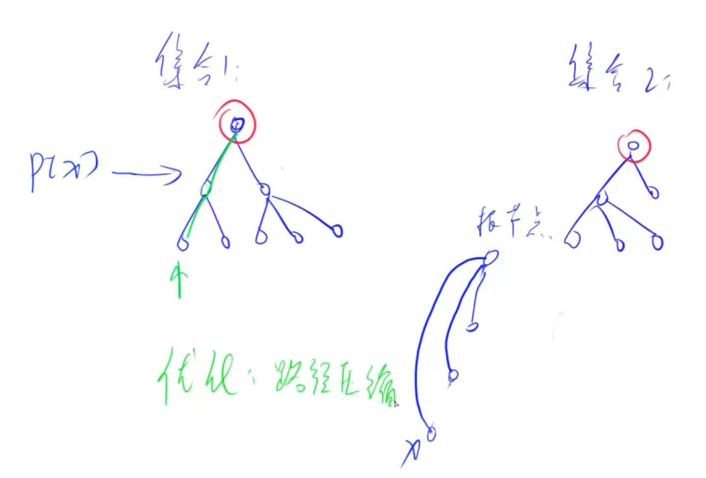
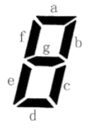
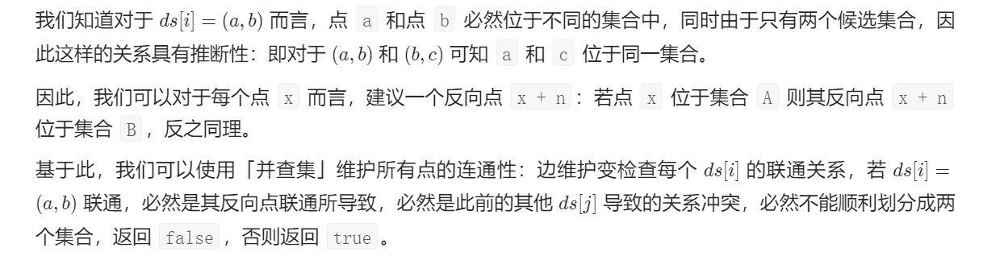

# 并查集

作用：

- 将两个集合合并
- 快速判断两个元素是否在一个集合当中

基本原理：每个集合用一个树来表示，树根的编号就是结点的编号，每个结点存储他的父节点，p[x]表示x的父节点

优化：路径压缩

当第一次找x的祖宗结点时发现`p[x] != x`那么就执行`p[x] = find(p[x])` 这样下次找的时候`p[x] == x`



```java
static int N = 100010;
static int[] p = new int[N], cnt = new int[N]; //p:根节点数组 cnt:记录连通块中结点数目

//并查集初始化
for (int i = 1; i <= n; i++){
    p[i] = i;
    cnt[i] = 1;
}
// 把集合x并入y
public static void union(int x, int y) {
    int px = find(x);
    int py = find(y);
    cnt[py] += cnt[px];
    p[px] = py;
}
//寻找x的父节点+路径压缩
public static int find(int x) {
    if(p[x] != x) p[x] = find(p[x]);
    return p[x];
}
// 获得连通块的数目
public static int get_connection() {
    int k = 0;
    for(int i = 1; i <= 7; i++) {
        if(st[i] && p[i] == i) k++;
    }
    return k;
}
```


## 七段码

题目链接：https://www.lanqiao.cn/problems/595/learning/?page=1&first_category_id=1&sort=students_count&name=%E4%B8%83%E6%AE%B5%E7%A0%81

**本题为填空题，只需要算出结果后，在代码中使用输出语句将所填结果输出即可。**

小蓝要用七段码数码管来表示一种特殊的文字。



上图给出了七段码数码管的一个图示，数码管中一共有 77 段可以发光的二 极管，分别标记为 ,,,,,,*a*,*b*,*c*,*d*,*e*,*f*,*g*。

小蓝要选择一部分二极管（至少要有一个）发光来表达字符。在设计字符 的表达时，要求所有发光的二极管是连成一片的。

例如：*b* 发光，其他二极管不发光可以用来表达一种字符。

例如 *c* 发光，其他二极管不发光可以用来表达一种字符。这种方案与上 一行的方案可以用来表示不同的字符，尽管看上去比较相似。

例如：,,,,*a*,*b*,*c*,*d*,*e* 发光，,*f*,*g* 不发光可以用来表达一种字符。

例如：,*b*,*f* 发光，其他二极管不发光则不能用来表达一种字符，因为发光 的二极管没有连成一片。

请问，小蓝可以用七段码数码管表达多少种不同的字符？

运行限制

- 最大运行时间：1s
- 最大运行内存: 128M


### 思路

本题需要判断所有的发光二极管是否属于同一个连通块，因此可以使用并查集，判断是否只有一个连通块

其次，可以使用dfs来枚举每个灯管是否发光，枚举所有状态

### 具体代码

注意：建图部分要小心仔细

```java
public class Main {
	static int N = 8,res = 0;
	static boolean[] st = new boolean[N];
	static int[] p = new int[N];
	static boolean[][] e = new boolean[N][N];
	public static int find(int x) {
		if(p[x] != x) p[x] = find(p[x]);
		return p[x];
	}
	public static void union(int x, int y) {
		int px = find(x);
		int py = find(y);
		if(px != py) p[px] = py;
	}
	public static void initConnect() {
		//e[x][y]:表示x和y相联
		//建图和初始化并查集
		e[1][2] = e[1][6] = true;
		e[2][1] = e[2][7] = e[2][3] = true;
		e[3][2] = e[3][7] = e[3][4] = true;
		e[4][3] = e[4][5] = true;
		e[5][4] = e[5][7] = e[5][6] = true;
		e[6][5] = e[6][7] = e[6][1] = true;
		e[7][2] = e[7][3] = e[7][6] = e[7][5] = true;
		
	}
	public static void init() {
		for(int i = 1; i <= 7; i++) p[i] = i;
	}
	public static void dfs(int u) {
		if(u > 7) {
            // 每次都要更新并查集
			init();
			for(int i = 1; i <= 7; i++) {
				for(int j = i; j <= 7; j++) {
					if(st[i] && st[j] && e[i][j]) union(i, j);
				}
			}
			if(isValid() == 1) res++;
			return;
		}
		st[u] = false;
		dfs(u+1);
		st[u] = true;
		dfs(u+1);
		return;
	}
	// 判断是不是只有一个连通块
	public static int isValid() {
		int k = 0;
		for(int i = 1; i <= 7; i++) {
			if(st[i] && p[i] == i) k++;
		}
		return k;
	}
	public static void main(String[] args) {
		initConnect();
		init();
		dfs(1);
		System.out.println(res);
	}

}
```


## 蓝桥侦探

蓝桥：https://www.lanqiao.cn/problems/1136/learning/

对应LeetCode：https://leetcode.cn/problems/possible-bipartition/

### 题目描述

小明是蓝桥王国的侦探。

这天，他接收到一个任务，任务的名字叫分辨是非，具体如下：

蓝桥皇宫的国宝被人偷了，犯罪嫌疑人锁定在 N*N* 个大臣之中，他们的编号分别为 1\sim N1∼*N*。

在案发时这 N*N* 个大臣要么在大厅11，要么在大厅22，但具体在哪个大厅他们也不记得了。

审讯完他们之后，小明把他们的提供的信息按顺序记了下来，一共 M*M* 条，形式如下：

- `x y`，表示大臣 x*x* 提供的信息，信息内容为：案发时他和大臣 y*y* 不在一个大厅。

小明喜欢按顺序读信息，他会根据信息内容尽可能对案发时大臣的位置进行编排。

他推理得出第一个与先前信息产生矛盾的信息提出者就是偷窃者，但推理的过程已经耗费了他全部的脑力，他筋疲力尽的睡了过去。作为他的侦探助手，请你帮助他找出偷窃者！

### 输入描述

第 11 行包含两个正整数 N,M*N*,*M*，分别表示大臣的数量和口供的数量。

之后的第 2 \sim M+12∼*M*+1 行每行输入两个整数 x , y*x*,*y*，表示口供的信息。

1\leq N,M \leq 5\times10^51≤*N*,*M*≤5×105，1 \leq x,y\leq N1≤*x*,*y*≤*N*。

### 输出描述

输出仅一行，包含一个正整数，表示偷窃者的编号。

### 输入输出样例

#### 示例 1

> 输入

```txt
4 5 
1 2
1 3 
2 3 
3 4
1 4
```

> 输出

```txt
2
```

### 运行限制

- 最大运行时间：1s
- 最大运行内存: 256M

### 题解

思路：反向点 + 并查集



图源：LeetCode【宫水三叶】判定二分图模板题的题解

### 代码

```java
import java.util.Scanner;
import java.io.*;
// 1:无需package
// 2: 类名必须Main, 不可修改

public class Main {
    static int[] father;
    public static void main(String[] args) throws IOException{
         StreamTokenizer sc = new StreamTokenizer(new BufferedReader(new InputStreamReader(System.in)));
        //在此输入您的代码...
        sc.nextToken();
        int N = (int) sc.nval;
        sc.nextToken();
        int M = (int) sc.nval;
        //并查集
        father = new int[2 * N +1];
        //初始化
        for(int i = 0; i <= 2*N; i++){
          father[i] = i;
        }
        while(M-- > 0){
          sc.nextToken();
          int x = (int) sc.nval;
          sc.nextToken();
          int y = (int) sc.nval;
          if(find(x) == find(y)){
            System.out.println(x);
            return;
          }
          union(x,y+N);
          union(x+N,y);
        }
    }
    //寻找根节点
    public static int find(int i){
      if(father[i] == i) return i;
      father[i] = find(father[i]);
      return father[i];
    }
    //合并集合
    public static void union(int x, int y){
      int fx = find(x);
      int fy = find(y);
      if(fx != fy) father[fx] = fy;
    }
}
```


