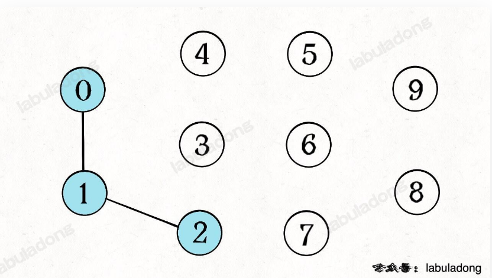
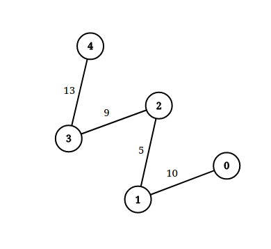

# 并查集

可以有效的将图论中分为多个连通图，以此来判断点之间的连通性



```java
//初始化
int[] uf = new int[n];
//并查集初始化
for(int i = 0; i < n; i++){
    uf[i] = i;
}
//将两结点相联
//将x,y连接
public void union(int x ,int y){
    int fx = find(x);
    int fy = find(y);
    uf[fx] = fy;
}
//寻找x的父节点
public int find(int x){
    if(uf[x] == x){
        return x;
    }
    return uf[x] = find(uf[x]);
}
```

## lc1697

[HARD]检查边长度限制的路径是否存在

给你一个 `n` 个点组成的无向图边集 `edgeList` ，其中 `edgeList[i] = [ui, vi, disi]` 表示点 `ui` 和点 `vi` 之间有一条长度为 `disi` 的边。请注意，两个点之间可能有 **超过一条边** 。

给你一个查询数组`queries` ，其中 `queries[j] = [pj, qj, limitj]` ，你的任务是对于每个查询 `queries[j]` ，判断是否存在从 `pj` 到 `qj` 的路径，且这条路径上的每一条边都 **严格小于** `limitj` 。

请你返回一个 **布尔数组** `answer` ，其中 `answer.length == queries.length` ，当 `queries[j]` 的查询结果为 `true` 时， `answer` 第 `j` 个值为 `true` ，否则为 `false` 。

**示例 1：**


```
输入：n = 3, edgeList = [[0,1,2],[1,2,4],[2,0,8],[1,0,16]], queries = [[0,1,2],[0,2,5]]
输出：[false,true]
解释：上图为给定的输入数据。注意到 0 和 1 之间有两条重边，分别为 2 和 16 。
对于第一个查询，0 和 1 之间没有小于 2 的边，所以我们返回 false 。
对于第二个查询，有一条路径（0 -> 1 -> 2）两条边都小于 5 ，所以这个查询我们返回 true 。
```

**示例 2：**



```
输入：n = 5, edgeList = [[0,1,10],[1,2,5],[2,3,9],[3,4,13]], queries = [[0,4,14],[1,4,13]]
输出：[true,false]
解释：上图为给定数据。
```

 

**提示：**

- `2 <= n <= 105`
- `1 <= edgeList.length, queries.length <= 105`
- `edgeList[i].length == 3`
- `queries[j].length == 3`
- `0 <= ui, vi, pj, qj <= n - 1`
- `ui != vi`
- `pj != qj`
- `1 <= disi, limitj <= 109`
- 两个点之间可能有 **多条** 边。

### 思路：并查集+离线查询

注意：对queries排序但不能改变原数组

可以额外增加一个indexs数组，indexs下标即为排序后的query下标

```java
Integer[] indexs = new Integer[queries.length];
for(int i = 0; i < queries.length; i++) indexs[i] = i;
Arrays.sort(indexs,(a,b) -> queries[a][2] - queries[b][2]);
```


```java
class Solution {
    static int[] uf;
    //并查集？通过并查集判断是否相连
    //排序添加 则可以判断是否符合题意
    //将edgeList和queries【离线查询】都按照距离从小到大排序
    public boolean[] distanceLimitedPathsExist(int n, int[][] edgeList, int[][] queries) {
        uf = new int[n];
        //并查集初始化
        for(int i = 0; i < n; i++){
            uf[i] = i;
        }
        //排序
        Arrays.sort(edgeList,(a,b) -> a[2] - b[2]);
        //[*]不能直接对query排序，新建一个index[]数组来标记访问顺序index[]的顺序即从小到大的顺序
        Integer[] indexs = new Integer[queries.length];
        for(int i = 0; i < queries.length; i++) indexs[i] = i;
        Arrays.sort(indexs,(a,b) -> queries[a][2] - queries[b][2]);
        //开始遍历
        boolean[] answer = new boolean[queries.length];
        int k = 0;
        for(int i : indexs){
            while(k < edgeList.length && edgeList[k][2] < queries[i][2]){
                //符合要求加入并查集
                union(edgeList[k][0],edgeList[k][1]);
                k++;
            }
            answer[i] = find(queries[i][0]) == find(queries[i][1]);
        }
        return answer;
    }
    //将x,y连接
    public void union(int x ,int y){
        int fx = find(x);
        int fy = find(y);
        uf[fx] = fy;
    }
    //寻找x的父节点
    public int find(int x){
        if(uf[x] == x){
            return x;
        }
        return uf[x] = find(uf[x]);
    }
}
```

