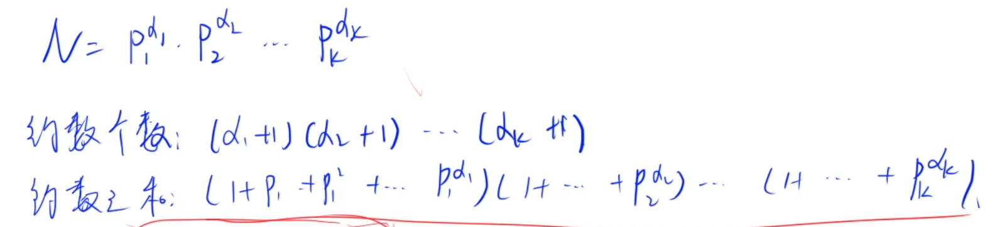

# 数论知识点汇总

## 常用函数

### swap

交换两个数

```java
public static void swap(int a, int b){
    a=a^b;
    b=a^b;
    a=a^b;
}
public static void swap(int a, int b){
    int t = a;
    a = b;
    b = a;
}
```

### 最大公因数gcd

```java
public static int gcd(int m, int n) { // 最大公因数
    if (m % n == 0)
        return n;
    return gcd(n, m % n);
}

public static int gcd(int a, int b) { // 最大公因数
    return b != 0 ? gcd(b, a % b) : a;
}
```

### 最小公倍数lcm

两者的关系

xy = gcd * lcm

```java
 public static int lcm(int m, int n) { // 最小公倍数
    return m * n / gcd(m, n);
}
```

### 扩展欧几里得算法exgcd

https://www.acwing.com/problem/content/879/


原理：


```java
static int x,y;
public static int exgcd(int a, int b){
    if(b == 0){
        x = 1;
        y = 0;
        return a;
    }
    int d = exgcd(b,a % b);
    int temp = y;
    y = x - a/b * y;
    x = temp;
    return d;
}
```

### 同余定理

原理就是利用扩展欧几里得算法来进行求解

https://www.acwing.com/problem/content/880/


```java
ax - my = b
ax + my' = b
求gcd(a,m) = d
如果b % d == 0则有解
解等于 x * (b/d) 
为了保证结果在int范围内要mod m
```

https://www.acwing.com/problem/content/1301/

```java
当利用exgcd求出了一组解（x0,y0）后，可以用其表示通解
x = x0 + kb
y = y0 - ka
因此求出一个解x后，如果希望x满足x > 0
则可以让x = x0 + kb
即x0对b取正mod
((x0%b) + b ) % b
```

### 取整

下取整a/b

上取整(a+b-1)/b

### 取模

让负数正数都取绝对值的mod

(a%b+b)%b

## 判断闰年

```java
//满足以下则是闰年
i%4==0&&i%100!=0||i%400==0
```

## 质数

### 试除法判断

```java
// 没优化版本 O(n)
public static boolean is_prime(int n){
    if(n < 2) return false;
    for(int i = 2; i < n; i++){
        if(n % i == 0) return false;
    }
    return true;
}
// 优化版本 O(sqrt(n))
// 原理：如果 d | n (整除)则 n / d | n 因此只需要枚举到sqrt(n)
public static boolean is_prime_2(int n){
    if(n < 2) return false;
    for(int i = 2; i <= n / i; i++){
        if(n % i == 0) return false;
    }
    return true;
}
```

### 筛质数

- 埃氏筛
- 欧拉筛（更快）

```java
import java.util.*;
public class Main{
    static Scanner sc = new Scanner(System.in);
    static int N = 1000010;
    static int cnt = 0;
    static int[] primes = new int[N];
    static boolean[] st = new boolean[N];
    // 埃氏筛法:对于每个质数，把他的合数筛掉 O(nlognlogn)
    public static void get_primes_ai(int n){
        for(int i = 2; i <= n; i++){
            if(!st[i]){
                primes[cnt++] = i;
                for(int j = i + i; j <= n; j+= i){
                    st[j] = true;
                }
            }
        }
    }
    // 欧拉筛
    // 每个数只会被他的最小质因子筛掉
    public static void get_primes_euler(int n){
        for(int i = 2; i <= n; i++){
            if(!st[i]) primes[cnt++] = i;
            for(int j = 0; primes[j] * i <= n; j++){
                st[primes[j] * i] = true;
                if(i % primes[j] == 0) break;
            }

        }
    }
    public static void main(String[] args){
        int n = sc.nextInt();
        get_primes_euler(n);
        System.out.print(cnt);
    }
}
```

### 分解质因数

本质也是试除法，遍历[2,sqrt(n)]，如果是质数就除

最后如果n > 1要把n加上

```java
//因式分解后求和
public List<Integer> yinshi(int n){
    List<Integer> list = new ArrayList<>();
    for(int i = 2; i <= n / i; i++){
        while(n % i == 0){
            list.add(i);
            n/=i;
        }
    }
    if(n > 1) list.add(n);
    return list;
}


public static void divide(int n){
    for(int i = 2; i <= n / i; i++){
        if(n % i == 0){
            int num = 0;
            while(n % i == 0){
                n /= i;
                num++;
            }
            System.out.println(i + " " + num);
        }
    }
    if(n > 1){
        System.out.println(n + " " + 1);
    }
    System.out.println();
}
```

## 约数

约数是指可以整除数x的数

### 试除法求约数

原理：和求质数原理一致，约数成对存在，因此遍历到sqrt(n)即可，使用TreeSet自动排序加去重

```java
import java.util.Scanner;
import java.util.TreeSet;

public class Main {
	static TreeSet<Integer> res = new TreeSet<>();
	static Scanner sc = new Scanner(System.in); 
	//试除法求约数
	public static void get_divisors(int x) {
		for(int i = 1; i <= x / i; i++) {
			if(x % i == 0) {
				res.add(i);
				res.add(x/i);
			}
		}
	}
	public static void main(String[] args) {
		int n = sc.nextInt();
		while(n-- > 0) {
			int x = sc.nextInt();
			res.clear();
			get_divisors(x);
			for(int i : res) {
				System.out.print(i+" ");
			}
			System.out.println();
		}
	}

}

```

### 约数个数和约数之和




每个数都可以拆解为`N = P_1^{d1} * P_2^{d2} ... P_k^{dk}`

Pi表示质数，di表示质数的个数

约数个数为`(d_1+1)(d_2+1)(d_k+1)`

约数之和`(1+P_1+P_1^2+...+P_1^{d1})(1+...+P_2^{d2})(1+...+P_k^{dk})`

利用上面公式写出代码

**约数个数**

- 用一个map存<质数,质数个数>
- 利用质因数分解来求质数和质数个数
- `(d_1+1)(d_2+1)(d_k+1)`

```java
import java.util.HashMap;
import java.util.Map;
import java.util.Scanner;
import java.util.TreeSet;

public class Main {
	static Scanner sc = new Scanner(System.in);
	static int MOD = (int)1e9+7;
	static Map<Integer, Integer> map = new HashMap<>(); 
	//<质数,质数个数>
	public static void main(String[] args) {
		int n = sc.nextInt();
		while(n-- > 0) {
			int x = sc.nextInt();
			//分解质因数求出质数和质数个数
			for(int i = 2; i <= x / i; i++) {
				while(x % i == 0) {
					map.put(i, map.getOrDefault(i, 0)+1);
					x /= i;
				}
			}
			if(x > 1) map.put(x, map.getOrDefault(x, 0)+1);
		}
		long res = 1;
		for(int d : map.values()) {
			res = res * (1 + d) % MOD;
		}
		System.out.println(res);
	}
}
```

**约数之和**

求出所有的质因数和个数后

利用公式进行求解

计算`(1+P_1+P_1^2+...+P_1^{d1})`的技巧

```java
long t = 1;
while(d-- > 0) t = (t * p + 1) % MOD;
```


```java
import java.util.HashMap;
import java.util.Map;
import java.util.Scanner;
import java.util.TreeSet;

public class Main {
	static Scanner sc = new Scanner(System.in);
	static int MOD = (int)1e9+7;
	static Map<Integer, Integer> map = new HashMap<>(); 
	//<质数,质数个数>
	public static void main(String[] args) {
		int n = sc.nextInt();
		while(n-- > 0) {
			int x = sc.nextInt();
			//分解质因数求出质数和质数个数
			for(int i = 2; i <= x / i; i++) {
				while(x % i == 0) {
					map.put(i, map.getOrDefault(i, 0)+1);
					x /= i;
				}
			}
			if(x > 1) map.put(x, map.getOrDefault(x, 0)+1);
		}
		long res = 1;
		for(int p : map.keySet()) {
			int d = map.get(p);
			long t = 1;
			while(d-- > 0) t = (t * p + 1) % MOD;
			res = res * t % MOD;
		}
		System.out.println(res);
	}
}
```


## 组合理论

### 多重组合理论求方案数


高中知识

a1 a2 ak都是一类相同的数，求排列方案，total! / 每一类的阶乘

## 回文串

判断回文串和求回文串

双指针

```java
public static boolean isHuiWen(String str){
    int i = 0, j = str.length() - 1;
    while (i < j){
        if(str.charAt(i) != str.charAt(j)) return false;
        i++;
        j--;
    }
    return true;
}
```

利用前四位数求出回文串

```java
int date = i, x = i;
//求回文
for(int j = 0; j < 4 ; j++){
    date = date * 10 + x % 10;
    x /= 10;
}
```

## 快速幂算法

用于快速求a^k，当数据量非常大时候可以用

算法原理：

a^k利用二进制可以将k转化为形如10011这样的数

那么
$$
a^k = a^{2^0+2^1+2^4} = a^{2^0}*a^{2^1}*a^{2^4}
$$
通过这样的转换可以将时间复杂度降为O(logn)

https://www.acwing.com/problem/content/description/877/

```java
import java.util.*;
import java.io.*;
public class Main{
    static BufferedReader br = new BufferedReader(new InputStreamReader(System.in));
    // 求a^b mod p
    public static int pmi(int a, int b, int p){
        int res = 1;
        while(b > 0){
            if((b & 1) == 1) res = (int)((long)res * a % p);
            a = (int)((long)a * a % p);
            b >>= 1;
        }
        return res;
    }
    public static void main(String[] args) throws IOException{
        int n = Integer.parseInt(br.readLine());
        while(n-- > 0){
            String[] data = br.readLine().split(" ");
            int a = Integer.parseInt(data[0]);
            int b = Integer.parseInt(data[1]);
            int p = Integer.parseInt(data[2]);
            System.out.println(pmi(a,b,p));
        }
    }
}
```

矩阵快速幂

https://www.acwing.com/problem/content/1305/

解法：

构造矩阵 $F_n = [f_n,f_{n+1},S_n] \quad F_{n+1} = [f_{n+1},f_{n+2},S_{n+1}]$
$$
\left[f_{n}, f_{n+1,} S_{n}\right]\left[\begin{array}{lll}
0 & 1 & 0 \\
1 & 1 & 1 \\
0 & 0 & 1
\end{array}\right]=\left[f_{n+1}, f_{n+2}, S_{n+1}\right]
$$
因此可以构造矩阵
$$
A= \left[\begin{array}{lll}
0 & 1 & 0 \\
1 & 1 & 1 \\
0 & 0 & 1
\end{array}\right]
$$

$$
F_n = F_1 * A^{n-1}
$$

由此可以构造出快速幂

代码如下：

```java
import java.util.*;
public class Main{
    static Scanner sc = new Scanner(System.in);
    static int N = 3,n,m;
    static long[][] f1 = {
        {1,1,1},
        {0,0,0},
        {0,0,0}
    };
    static long[][] A = {
        {0,1,0},
        {1,1,1},
        {0,0,1}
    };
    // 矩阵乘法
    public static void mui(long[][] c, long[][] a, long[][] b){
        // 由于会改变a数组，所以可以将a b矩阵相乘的结果放到新数组，等操作完再copy回去
        long[][] temp = new long[N][N];
        for(int i = 0; i < N; i++){
            for(int j = 0; j < N; j++){
                for(int k = 0; k < N; k++){
                    temp[i][j] = (temp[i][j] + a[i][k] * b[k][j]) % m;
                }
            }
        }
        System.arraycopy(temp,0,c,0,N);
    }
    public static void main(String[] args){
        n = sc.nextInt();
        m = sc.nextInt();
        n--;
        while(n > 0){
            if((n&1) == 1) mui(f1,f1,A);
            n >>= 1;
            mui(A,A,A);
        }
        System.out.println(f1[0][2]);
    }
}
```

## 进制转换

```java
// 将字符串转换为指定进制的数
	public static int base(char[] s, int b) {
		int res = 0;
		for(char c : s) res = res * b + c -'0';
		return res;
	}
```


