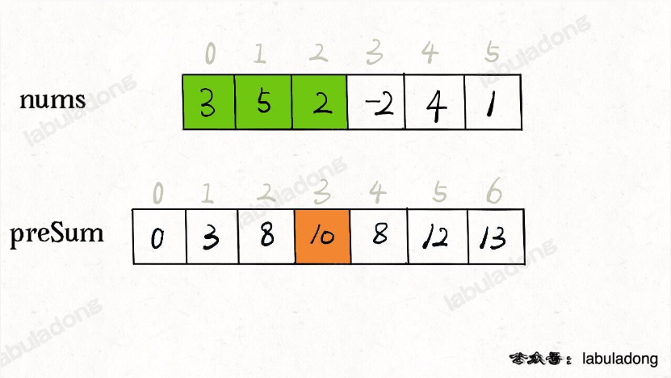
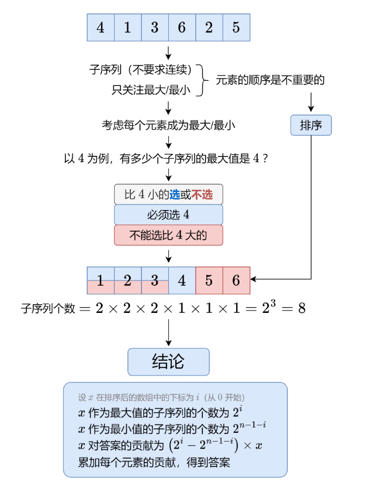

# 记录子数组，使用贡献度法

### 蓝桥杯子串分值

https://www.lanqiao.cn/problems/499/learning/

```java
import java.util.Scanner;
// 1:无需package
// 2: 类名必须Main, 不可修改

public class Main {
    static int result = 0;
    public static void main(String[] args) {
        Scanner scan = new Scanner(System.in);
        String S = scan.nextLine();
        char[] array = S.toCharArray();
        int len = array.length;
        for(int i = 0; i < len; i++){
          int left = 0;
          int right = 0;
          for(int j = i - 1; j >= 0 && array[j] != array[i]; j--){
            left++;
          }
          for(int j = i + 1; j < len && array[j] != array[i]; j++){
            right++;
          }
          result += (left + 1) * (right + 1);
        }
        System.out.println(result);
        scan.close();
    }
}
```

### lc.907. 子数组的最小值之和

https://leetcode.cn/problems/sum-of-subarray-minimums/description/

#### 方法1：不使用单调栈做法 left right记录长度

```java
class Solution {
    private static final long MOD = (long) 1e9 + 7;
    public int sumSubarrayMins(int[] arr) {
        long res = 0L;
        int n = arr.length;
        //计算贡献度
        for(int i = 0; i < n; i++){
            int left = 0;
            int right = 0;
            //避免相同元素重复计算，因此left或者right有一边需要统计大于等于就暂停
            //本做法的left right是长度 也可以使用下标法
            //根据乘法原理arr[i]贡献度为arr[i] * (left + 1) * (right + 1)
            for(int j = i - 1; j >= 0 && arr[j] >= arr[i]; j--) left++;
            for(int j = i + 1; j < n && arr[j] > arr[i]; j++) right++;
            int f = (left + 1) * (right + 1);
            res += (long)f * arr[i];
        }
        return (int) (res % MOD);
    }
}
```

#### 方法2：使用单调栈记录(L,R)的下标

```java
class Solution {
    private static final long MOD = (long) 1e9 + 7;
    public int sumSubarrayMins(int[] arr) {
        int n = arr.length;
        int[] left = new int[n];
        Stack<Integer> st = new Stack<>();
        st.push(-1);
        //维护一个严格单调递增的单调栈
        //找到左边小于arr[i]的最近元素位置（不存在-1）
        for(int i = 0; i < n; i++){
            while(st.size() > 1 && arr[st.peek()] >= arr[i])
                st.pop();
            left[i] = st.peek();
            st.push(i);
        }
        //找到右边小于等于arr[i]的最近元素位置（不存在n）
        int[] right = new int[n];
        st.clear();
        st.push(n);
        for(int i = n - 1; i >= 0; i--){
            while(st.size() > 1 && arr[st.peek()] > arr[i])
                st.pop();
            right[i] = st.peek();
            st.push(i);
        }
        long res = 0L;
        //计算贡献度
        for(int i = 0; i < n; i++){
            res += (long) arr[i] * (i - left[i]) * (right[i] - i);
        }
        return (int) (res % MOD);
    }
}
```

#### lc.1856 前缀和数组 + 单调栈

https://leetcode.cn/problems/maximum-subarray-min-product/description/

前缀和数组图解：

来源labuladong的算法小抄



本题要求子数组范围内的和，如果暴力遍历加法会超时，使用前缀和可以解决

```java
class Solution {
    private static final long MOD = (long) 1e9 + 7;
    public int maxSumMinProduct(int[] nums) {
        if(nums == null || nums.length == 0) return 0;
        int n = nums.length;
        //前缀和数组
        long[] pre = new long[n + 1];
        for(int i = 1; i <= n; i++){
            pre[i] = pre[i-1] + nums[i-1];
        }
        //记录左边第一个小于nums[i]的下标
        int[] left = new int[n];
        Stack<Integer> st = new Stack<>();
        st.push(-1);
        for(int i = 0; i < n; i++){
            while(st.size() > 1 && nums[st.peek()] >= nums[i])
                st.pop();
            left[i] = st.peek();
            st.push(i);
        }
        //记录右边第一个小于等于nums[i]的下标
        int[] right = new int[n];
        st.clear();
        st.push(n);
        for(int i = n - 1; i >= 0; i--){
            while(st.size() > 1 && nums[st.peek()] > nums[i])
                st.pop();
            right[i] = st.peek();
            st.push(i);
        }
        long res = 0L;
        for(int i = 0; i < n; i++){
            long sum = pre[right[i]] - pre[left[i] + 1];
            res = Math.max(res,(long) nums[i] * sum);
        }
        return (int) (res % MOD);
    }
}
```

## lc891.子序列宽度之和

一个序列的 **宽度** 定义为该序列中最大元素和最小元素的差值。

给你一个整数数组 `nums` ，返回 `nums` 的所有非空 **子序列** 的 **宽度之和** 。由于答案可能非常大，请返回对 `109 + 7` **取余** 后的结果。

**子序列** 定义为从一个数组里删除一些（或者不删除）元素，但不改变剩下元素的顺序得到的数组。例如，`[3,6,2,7]` 就是数组 `[0,3,1,6,2,2,7]` 的一个子序列。

 

**示例 1：**

```
输入：nums = [2,1,3]
输出：6
解释：子序列为 [1], [2], [3], [2,1], [2,3], [1,3], [2,1,3] 。
相应的宽度是 0, 0, 0, 1, 1, 2, 2 。
宽度之和是 6 。
```

**示例 2：**

```
输入：nums = [2]
输出：0
```

 

**提示：**

- `1 <= nums.length <= 105`
- `1 <= nums[i] <= 105`



注意对于幂运算需要先进行预处理

```java
class Solution {
    private static final int MOD = (int) 1e9 + 7;
    int n = 0;
    public int sumSubseqWidths(int[] nums) {
        n = nums.length;
        if(n <= 1 || nums == null) return 0;
        Arrays.sort(nums);
        //预先处理2的幂
        int[] pow2 = new int[n];
        pow2[0] = 1;
        for(int i = 1; i < n; i++){
            pow2[i] = pow2[i-1] * 2 % MOD;
        }
        long res = 0L;
        for(int i = 0; i < n; i++){
            res += (long) (pow2[i] - pow2[n - i - 1]) * nums[i];
        }
        //res可能为负数
        return (int) (res % MOD + MOD) %MOD;
    }
}
```

